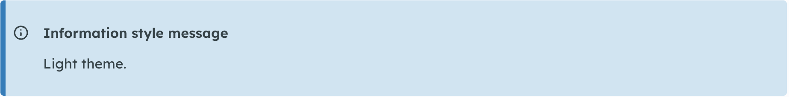
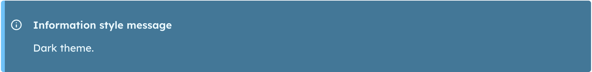
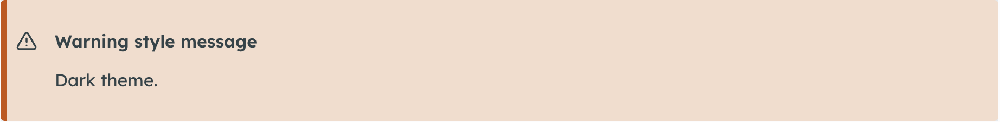
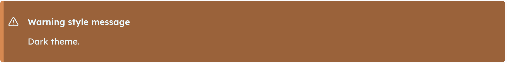
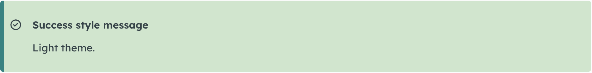
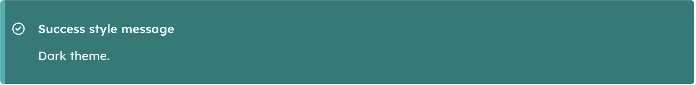
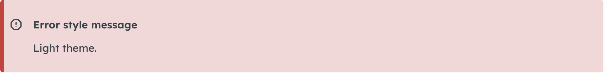
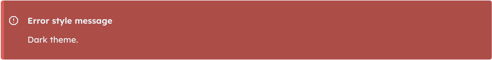

# Message

The Message component is used to display important notifications and alerts to users. It communicates status, urgency, and context through clear visual styling such as colour and iconography.

<figure><figcaption></figcaption></figure>

### How to create a Message

1. Log in as a _Content author_.
2. Create a new _Page_ or navigate to the page you want to add the Message to.
3. Click on the _Components_ dropdown and select _Message_.
4. Open the _Type_ dropdown to select the type of Message you want to display:
   1. Information
   2. Error
   3. Success
   4. Warning
5. Add an optional _Title_. This will display next to the icon at the top of the message.&#x20;
6. Add optional _Content_.&#x20;
7. Select _Light_ or _Dark_ theme.
8. Set the _Vertical_ spacing.
9. Note: the _Background_ is not enabled for the Message.

### Message examples

The colours below are examples using CivicTheme OOTB colour settings.

<figure><figcaption></figcaption></figure>

<figure><figcaption></figcaption></figure>

<figure><figcaption></figcaption></figure>

<figure><figcaption></figcaption></figure>

<figure><figcaption></figcaption></figure>

<figure><figcaption></figcaption></figure>

<figure><figcaption></figcaption></figure>

<figure><figcaption></figcaption></figure>

### Further Message resources

#### Storybook

Interact with the [Message component](https://uikit.civictheme.io/?path=/story/organisms-message--message) in Storybook.

#### UX evidence framework

Read the [UX evidence behind the Message component](message.md).&#x20;

