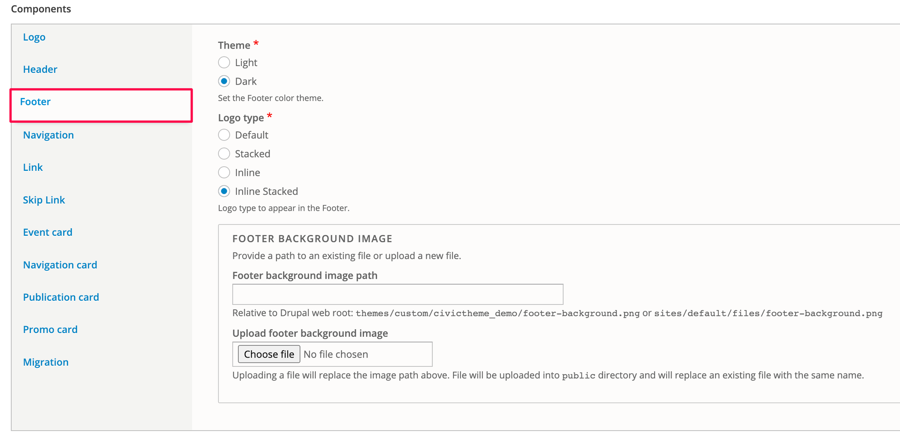
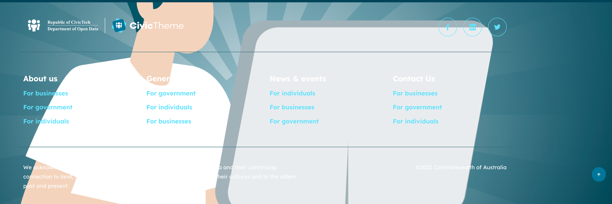

# Footer

The Footer setting allows you to select the Theme, Logo type and Background image for the Footer.\

### Theme

The Footer can be shown in Light or Dark theme.

### Logo type 

Depending on the space within your site's Footer, you can select how the Logo (with one or two images) is shown. The space could be limited due to a high number of Primary Navigation links that sit inline with the logo.

The following table outlines the Logo type using example logos:

| **Logo type**  | **Final output (desktop)**             | **Final output (mobile)**              |
| -------------- | -------------------------------------- | -------------------------------------- |
| Default        |  |  |
| Stacked        |  |  |
| Inline         |  |  |
| Inline stacked |  |  |

As you can see, only "Inline stacked" has a different behaviour on desktop and mobile.

### Background image 

Background image allows you to specify the URL of a custom image or upload a custom image that will be shown as a Footer background. Below is an example:

<figure><figcaption></figcaption></figure>

