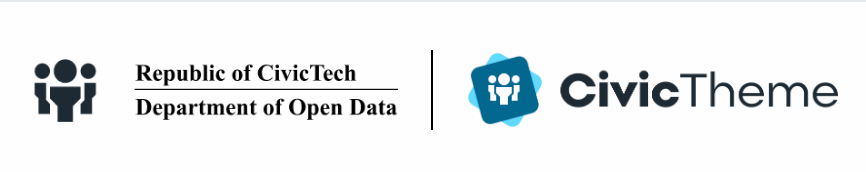

# Footer

Footer setting allow to select the Theme, Logo type and Background image\
.png>)

### Theme

Footer can be shown in Light or Dark theme.

### Logo type 

Depending on the space within a Footer of your site, you can selected how the Logo (with one or two images) is shown. The space could be limited due to a high number of Primary Navigation links that sit inline with the logo.

The following table outlines the Logo type using example logos:

| **Logo type**  | **Final Output (Desktop)**             | **Final Output (mobile)**              |
| -------------- | -------------------------------------- | -------------------------------------- |
| Default        |  |  |
| Stacked        |  |  |
| Inline         |  |  |
| Inline Stacked |  |  |

As you can see, only "Inline Stacked" has a different behaviour on Desktop and mobile.

### Background image 

Background image allows to specify the URL or upload a custom image that will be shown as a Footer background:

<figure><figcaption></figcaption></figure>

