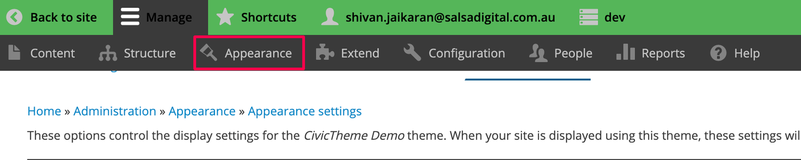
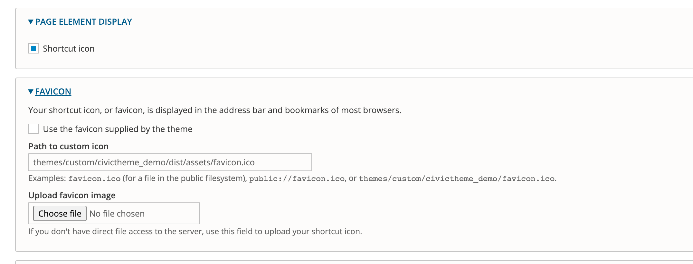

# Theme settings

### Summary 

This article will guide you on the different theme configurations that are available for CivicTheme.

Most of the settings you find here are applied globally across your site.

### Accessing the CivicTheme configuration page 

1. Click on Appearance as shown in Figure 1.

<figure><figcaption></figcaption></figure>

2. Click on “Settings” next to your installed CIvicTheme.

<figure><figcaption></figcaption></figure>

### Overview of the CivicTheme configuration page 

<figure><figcaption></figcaption></figure>

Page element display and Favicon

The expanded versions of these sections are shown in Figure 4.

<figure><figcaption></figcaption></figure>

Once the checkbox “Shortcut icon” is checked, then the Favicon options become available. You can upload your custom Favicon here.

### Colors 

The expanded Colors settings are shown in Figure 5 below.

The most important setting is the “Use Color Selector” checkbox (highlighted in Figure 5).

If **checked**, then you can edit the colors by using the color palette. Additionally, you can also override some colors with CSS code although this is not recommended.

If **unchecked**, all colors will be overridden from your CSS code.

The Brand colors use predefined formulas that automatically update the palette colors. In other words, if you change the brand colors, then its corresponding dependents will automatically update. Click on “show dependants” to see the relationship.

### Components 

The Components sections are split into multiple sections. Click the links below to read further documentation on these sections.

[Logo](broken-reference)

[Header](broken-reference)

[Footer](broken-reference)

Navigation - Edit the dropdown type for menus and its related settings.

Link - Global settings for links

Skip Link - Set the theme color for the Skip Link. [What is a Skip Link?](https://en.wikipedia.org/wiki/Skip\_link)

Event card, Navigation card, Publication card, Promo card - Set the default summary length.

Migration - “Expose migration metadata” exposes metadata as data attributes on HTML elements.

### Storybook 

Storybook demonstrates components used in your site as a standalone library.

The components in the Storybook are visual representation and they are not connected to the Drupal components.

Each component has properties that allow to change component and see how it visually changes.

While being primarily a development tool, the Storybook allows everyone to see all components at-a-glance without creating any special content for it.
