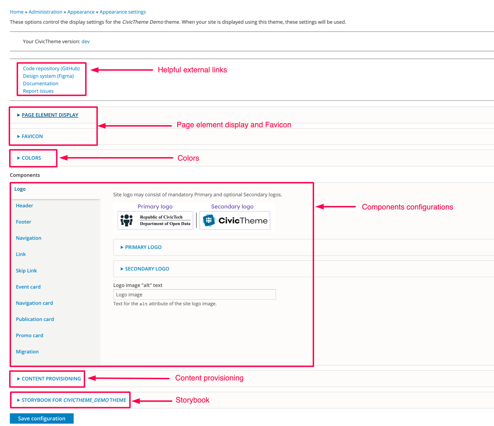

# Theme settings

### Summary 

This article will guide you on the different theme configurations that are available for CivicTheme.

Most of the settings you find here are applied globally across your site.

### Accessing the CivicTheme configuration page 

NOTE: You must be logged in as a user with a "Site administrator" role to access this page.

1. Click on Appearance as shown in Figure 1.

<figure><figcaption></figcaption></figure>

2. Click on “Settings” next to your installed CIvicTheme.

<figure><figcaption></figcaption></figure>

### Overview of the CivicTheme configuration page 

<figure><figcaption></figcaption></figure>

### Page element display and Favicon 

<figure><figcaption></figcaption></figure>

Once the checkbox “Shortcut icon” is checked, then the Favicon options become available. You can upload your custom Favicon here.

### Colors 

See [Colors](../content-authoring/site-wide-configuration/theme-settings/colors.md) sub-section.

### Components 

The Components sections are split into multiple sections. Click the links below to read further documentation on these sections.

* [Logo](../content-authoring/site-wide-configuration/logos.md)
* [Header](broken-reference)
* [Footer](broken-reference)
* Navigation
* Link
* Skip Link
* Event card, Navigation card, Publication card, Promo card
* Migration

### Storybook 

Storybook demonstrates components used in your site as a standalone library.

The components in the Storybook are visual representation and they are not connected to the Drupal components.

Each component has properties that allow to change component and see how it visually changes.

While being primarily a development tool, the Storybook allows everyone to see all components at-a-glance without creating any special content for it.
