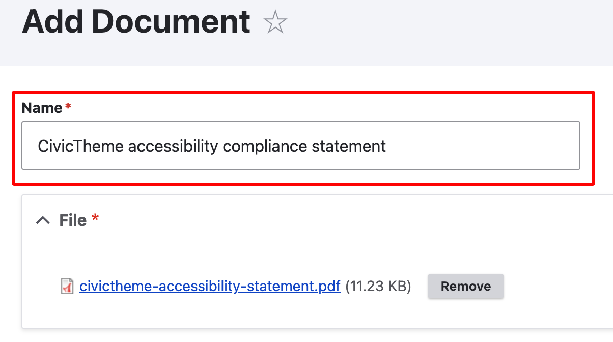

# Attachment

The Attachment component allows you add a downloadable document. The component displays a title, the last updated date and a [configurable document title](attachment.md#configuring).

### Add an Attachment

1. On the page where you want to add the Attachment, open the from the dropdown list.

<figure><figcaption></figcaption></figure>

2. Add a Title to display at the top of the component.
3. Add Content, optional. Useful to describe the document.
4. Add one or more files to the Attachment component.
5. Save.

### Styling

<figure><figcaption></figcaption></figure>

#### Theme

Every component in CivicTheme, such as the "Attachment" component, can be shown as a `Light` or `Dark` theme component variant. This allows you to build more engaging landing pages with a mix of light and dark theme components.&#x20;

Use "Theme" radio button selector to change between themes.

Below illustrates the `Light` theme, using the "Content" field, and the media "Name".

<figure><figcaption></figcaption></figure>

Below illustrates the `Dark` theme and the document file name.

<figure><figcaption></figcaption></figure>

#### Vertical spacing

Vertical spacing adds space before, after or both before and after a component. It is used to visually separate a component from other components when they are vertically stacked on the page. Use "Vertical spacing" dropdown to chose the appropriate values.&#x20;

You may need to adjust the vertical spacing on adjacent components to create visual balance.

#### Background

**DO NOT USE**. Don't use the "Background" on the "Attachment" component Selecting `Light` or `Dark` theme adds the appropriate background.

### Configuring

Some site-wide configuration can be made for this component. You need to be logged in as a "Site administrator" role in order to make such changes.

You can configure the "Attachment" component to display the actual file name, or the editable "Name" you give to the file when you upload it.  &#x20;

#### Configure to use the "Name"

1. When you upload the file, ensure you create a descriptive, human-readable "Name".

<figure><figcaption></figcaption></figure>

2. Go to `/admin/appearance/settings/<site-name>`
3. Check the "Use name of media" box.&#x20;

<figure><figcaption></figcaption></figure>

#### Configure to use the document file name

1. Go to `/admin/appearance/settings/<site-name>`
2. Uncheck the "Use name of media" box.&#x20;
