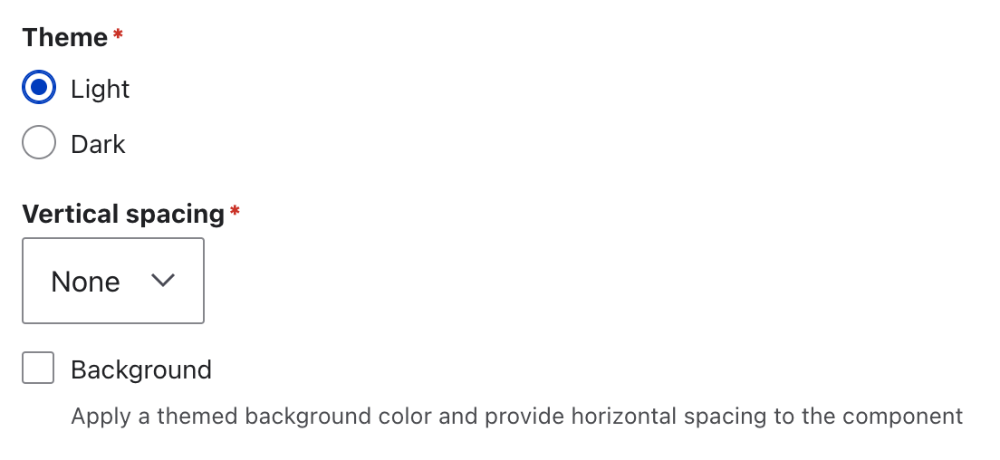

# Quote

The "Quote" style allows you to add a visually styled quotation to the page.

Use the "Quote" to highlight a piece of content and provide a reference point. For example, customer testimonials, statistics or data, or quotes from interviews.

### Add a Quote

1. Create a "Content" component and add content.
2. Highlight the content you want to style as the quote, including the reference content.
3. Select the "Block quote" icon in the CK Editor.

<figure><figcaption></figcaption></figure>

2. Then highlight only the reference content.
3. Open the "Styles" select box and select "Small".

<figure><figcaption></figcaption></figure>

### Outcome

<figure><figcaption></figcaption></figure>

### Styling

<figure><figcaption></figcaption></figure>

#### Theme

Every component in CivicTheme, such as the "Content" component, can be shown as a `Light` or `Dark` theme component variant. This allows you to build more engaging landing pages with a mix of light and dark components.&#x20;

#### Background

Setting a "Background" on a component can make the component visually stand-out on the page. Check the "Background" checkbox to apply a background to the component.&#x20;

**Tip**

If you want to create a striking stand alone "Quote" with a background to really separate it from other content, you need to put the quote and reference content in its own "Content" component, surrounded by other "Content" components.&#x20;

The example below shows three separate "Content" components. The first and third components use the `Light` theme. The second component, housing the "Quote" "uses the `Dark` theme, with the Background checkbox filled.

<figure><figcaption></figcaption></figure>

The example below shows three separate Content components. All three components use the `Light` theme, but the component housing the Quote has the Background checkbox filled.

<figure><figcaption></figcaption></figure>

#### Vertical spacing

"Vertical spacing" adds space before, after or both before and after a component. It is used to visually separate a component from other components when they are vertically stacked on the page. Use "Vertical spacing" dropdown to chose one of the appropriate values.
