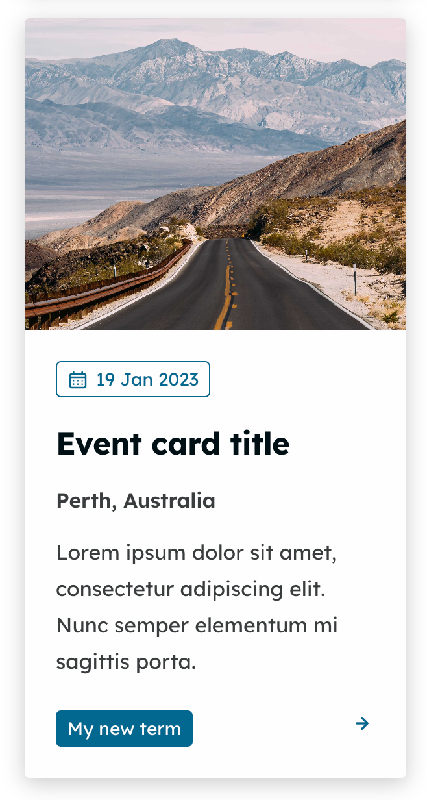
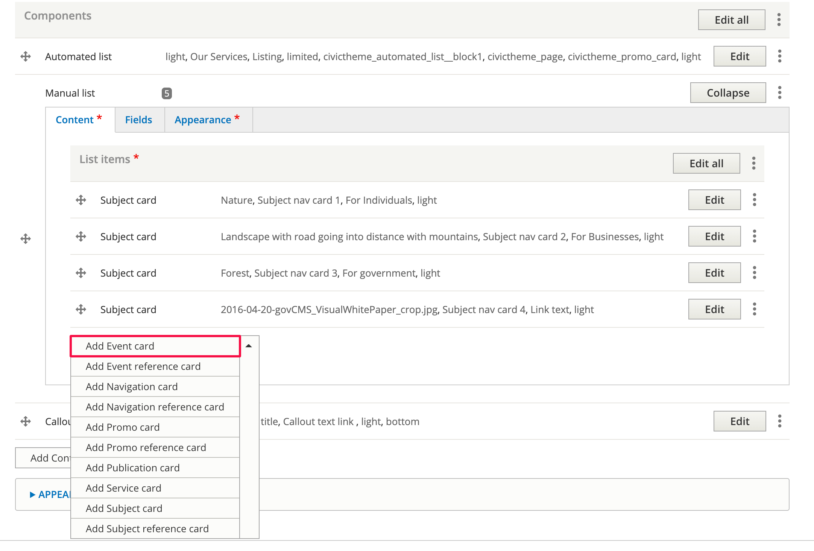
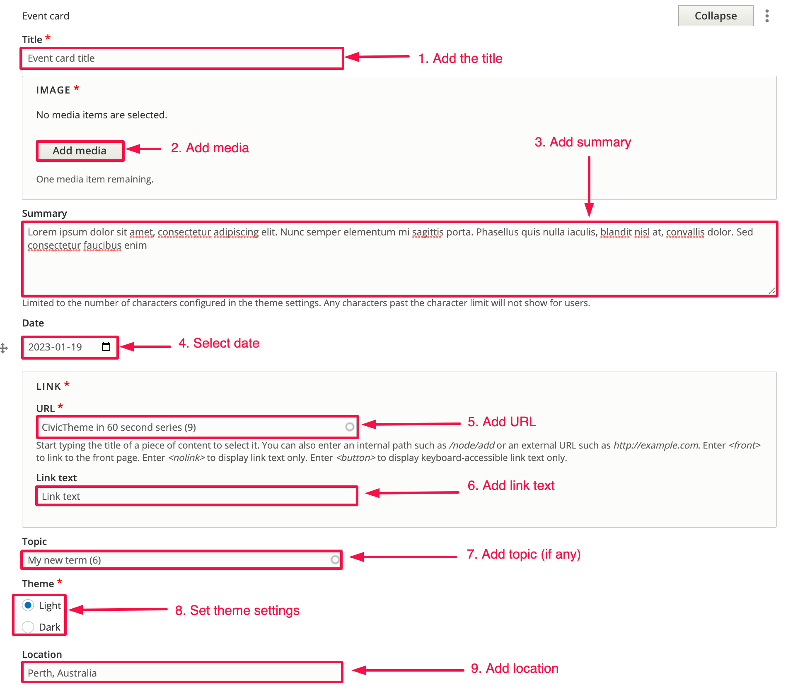

# Event card

### Summary

Event cards are used to highlight events and are created within the Manual list component. &#x20;

This section shows you how to add an Event card.

### Step 1 - Add the Event card 

Within the Manual list component under List items, click on the dropdown and select Event card.

### Step 2 - Add details to the Event card 

You can see the fields in the screenshot below.&#x20;

Most of the highlighted fields are simple, self-explanatory text fields. Some of the non-text fields are explained below.

4\. Date - You can click on the calendar icon to select a date from the popup date widget.

5\. URL - This is an autocomplete field. Start by typing the title of the internal page or enter an external URL.

6\. Topic (optional) - This is an autocomplete field. Terms must first exist in your [Topics](../vocabularies/topics.md) vocabulary.
