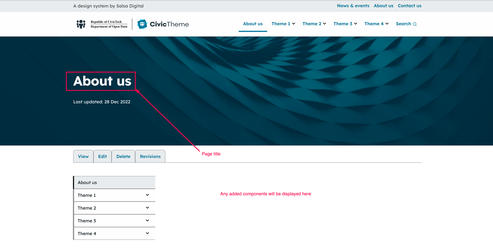
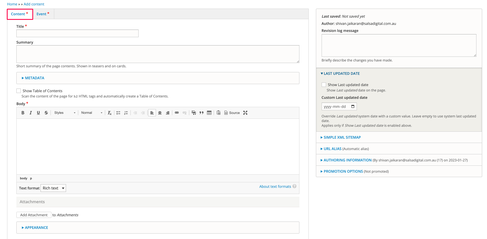
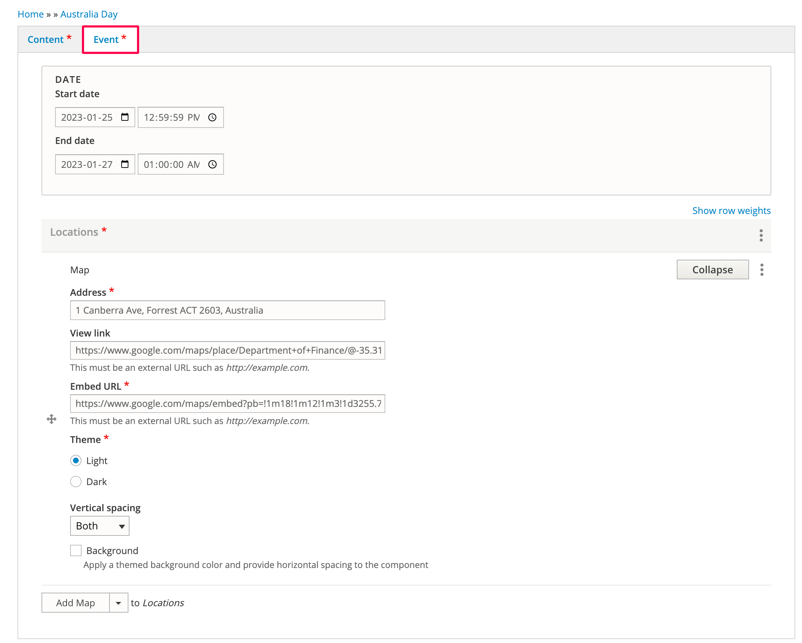
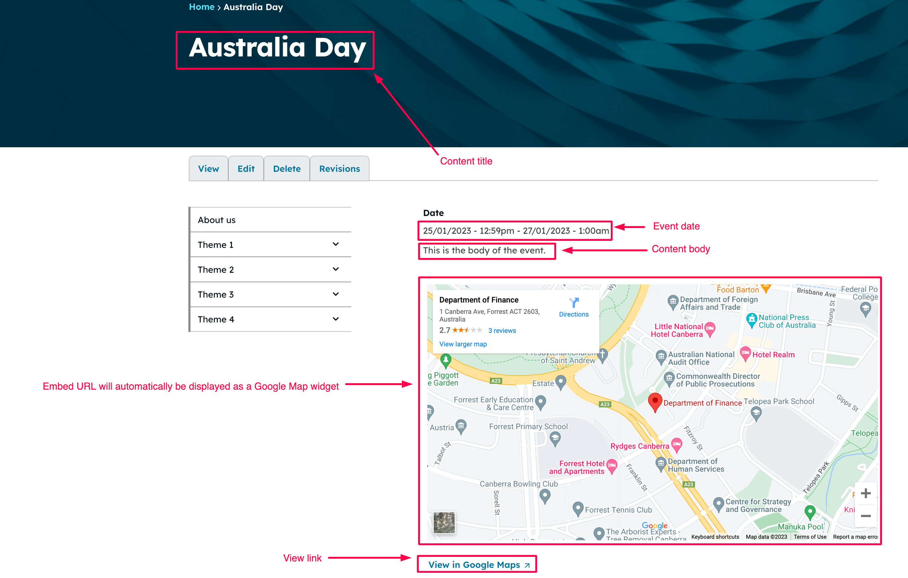
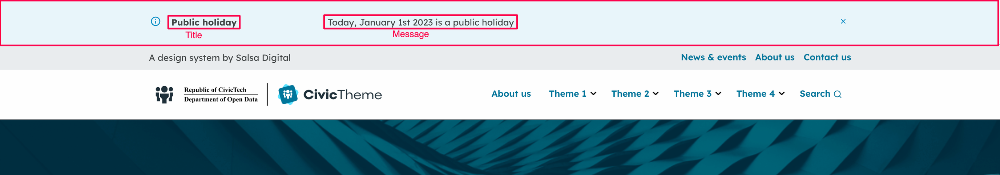
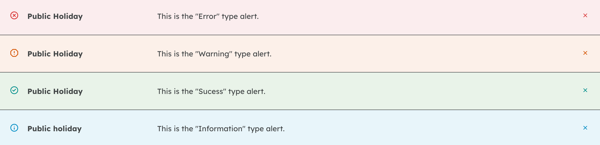

# Content types

Out-of-the-box, CivicTheme comes with 3 content types:

* [Page](content-types.md#contentauthoring-overview-page)
* [Event](content-types.md#contentauthoring-overview-event)
* [Alert](content-types.md#contentauthoring-overview-alert)

These are the most common content types that you would need to start of as a base. You can add more content types as necessary.

### Page 

Use Page for your static content such as an "About us" page or other informational pages that will always be accessible on the site. These can be simple content pages or pages with a complex layout.

When you add a Page, there are 2 tabs: Content and Banner.

The fields for the Content tab:

<figure><figcaption></figcaption></figure>

The fields for the Banner tab:

<figure><figcaption></figcaption></figure>

While you can add various components to the page and banner, the most simplistic Page output with a Content component is shown below:

<figure><figcaption></figcaption></figure>

### Event 

As the name suggests, you can use the Event content type for creating events that spans across multiple dates.

When you add an Event, there are 2 tabs: Content and Event.

The fields for the Content tab:

<figure><figcaption></figcaption></figure>

The fields for the Event tab:

<figure><figcaption></figcaption></figure>

The final output for an Event with a Map component:

<figure><figcaption></figcaption></figure>

### Alert 

Use alerts to provide information for site users using a horizontal bar at the top of the screen. Common examples are announcements, notices, warning, downtime alerts or any other alerts that you want your site visitor to see right away at the top of the page.

<figure><figcaption></figcaption></figure>

Depending on which "type" you select, the Alert background colour can be different:

<figure><figcaption></figcaption></figure>

Alerts can be set to appear on all pages on the site or only on selected paths. They can also be scheduled to appear only within a dedicated date range.

Once a website user dismisses an alert by pressing on the close Button (x), the alert will no longer appear when a user visits this page again. The alert, however appear, if its content changes (in case if some important information needs to be added to an existing alert).
