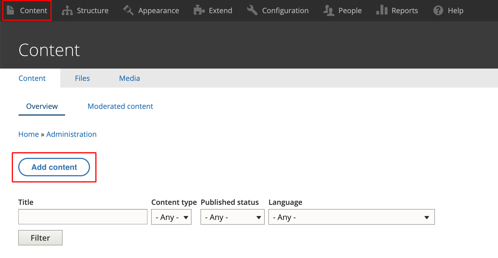

# Landing Page

Landing pages are pages with a complex layout, such as homepage or a section page.

Landing pages can be created using Page content type and one or multiple components.

### Step 1 - Go to the admin content interface 

From the main toolbar menu at the top of the page, click on “Content”.

<figure><figcaption>
Figure 1
</figcaption></figure>

Optionally, you can go directly to _\[your\_domain]/admin/content_

### Step 2 - Click on “Add content” 

<figure><figcaption>
Figure 2
</figcaption></figure>

### Step 3 - Add a Page 

<figure><figcaption>
Figure 3
</figcaption></figure>

### Step 4 - Fill in the various fields under the “Content” tab 

Figure 4 shows a screenshot of some of the available fields. We have numbered them for easier explanations.

<figure><figcaption>
Figure 4
</figcaption></figure>

1. Enter the page title.
2. Add components as needed. See [section about Components](../landing-page/adding-components-wip/).
3. Uncheck this box if you would like to add a custom URL alias. The URL alias is what site visitors will see in the browser address bar and also this will show up in search engine results.
4. If you unchecked the box as in point #3 above, then this field becomes available. Enter the custom URL alias. Be mindful that it must start with a forward slash. For e.g. /your-custom-url
5. If you need to add a Menu, click here to expand this section. Once expanded, you will be shown the fields as in Figure 5. Enter the Menu link title and select the Parent link it will fall under. The Weight determines the ordering of the Menu item being created compared to the other existing Menu items. A bigger weight will place it lower in the Parent menu.

<figure><figcaption>
Figure 
</figcaption></figure>

Click on “Save” when you are finished.

<figure><figcaption>
Figure 6
</figcaption></figure>
