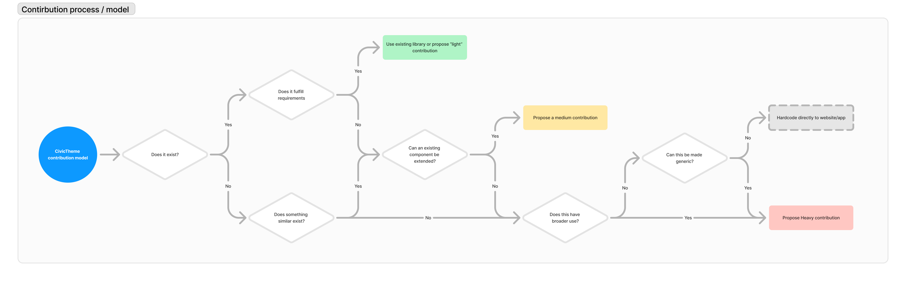

# Landing Page

Landing pages are pages with a complex layout, such as homepage or a section page.

Landing pages can be created using Page content type and one or multiple components.

### Step 1 - Go to the admin content interface 

From the main toolbar menu at the top of the page, click on “Content”.

<figure><figcaption>
Figure 1
</figcaption></figure>

Optionally, you can go directly to _\[your\_domain]/admin/content_

### Step 2 - Click on “Add content” 

<figure><figcaption>
Figure 2
</figcaption></figure>

### Step 3 - Add a Page 

<figure><figcaption>
Figure 3
</figcaption></figure>

### Step 4 - Fill in the various fields under the “Content” tab 

Figure 4 shows a screenshot of some of the available fields. We have numbered them for easier explanations.

<figure><figcaption>
Figure 4
</figcaption></figure>

1. Enter the page title.
2. Add components as needed. See [section about Components](../landing-page/adding-components-wip/).
3. Uncheck this box if you would like to add a custom URL alias. The URL alias is what site visitors will see in the browser address bar and also this will show up in search engine results.
4. If you unchecked the box as in point #3 above, then this field becomes available. Enter the custom URL alias. Be mindful that it must start with a forward slash. For e.g. /your-custom-url
5. If you need to add a Menu, click here to expand this section. Once expanded, you will be shown the fields as in Figure 5. Enter the Menu link title and select the Parent link it will fall under. The Weight determines the ordering of the Menu item being created compared to the other existing Menu items. A bigger weight will place it lower in the Parent menu.

<figure><figcaption>
Figure 
</figcaption></figure>

### Step 5 - Optionally modify Banner per-page overrides 

Please note that these are **per-page** overrides of a [site-wide banner](../site-wide-configuration/banner.md) and they do not need to be updated on every page if the site-wide banner configuration is sufficient.

<figure><figcaption>
Figure 3
</figcaption></figure>

The available fields are shown in Figure 4. We have numbered the fields and explained each below.

<figure><figcaption>
Figure 4
</figcaption></figure>

1. Banner type - You can specify the size of the banner here with choices of Inherit, Default or Large.&#x20;
2. Banner theme - You can specify the theme colour. “Inherit” will inherit the value defined for your custom banner block which you can find at _\[your\_domain]/admin/structure/block/block-content._
3. Banner title - you can override the page title here.
4. Hide breadcrumb - if your homepage has a breadcrumb, checking this box will hide it. Typically, homepages do not have breadcrumbs so toggling this checkbox may not have any effect on your homepage.
5. Background image - as the name suggests, this will update the background image in the banner area.
6.  Featured image - you can apply a featured image which will appear on the right side of your banner.\

    <figure><figcaption>
Figure 5
</figcaption></figure>

7\. Content component - This is an example component added for illustrations purposes. There are many other components to choose from.

<figure><figcaption>
Figure 6
</figcaption></figure>

8\. Manual list component - This is another example of a component. Components added to the “Banner bottom components” appear under the banner as shown in Figure 7 below.

Click on “Save” when you are finished.
