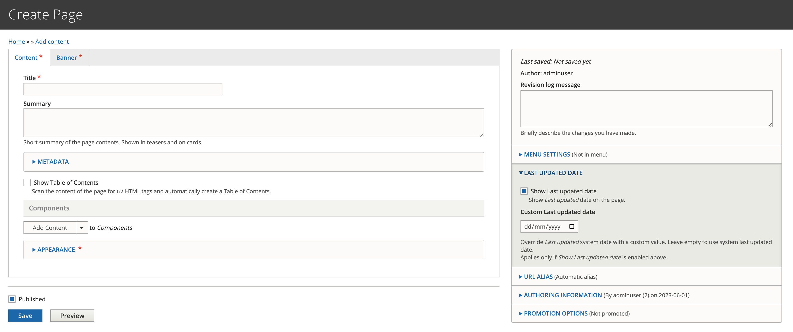

# Page content type

The 'Page' content type is the most flexible content type. This content type allows you to choose from a wide selection of components to build a striking [Landing page](landing-page.md) or a simpler [Content page](content-page.md).

By default all Pages on your site will inherit the [site-wide banner](../../site-wide-configuration/banner.md), but you can customise the banner on a per page basis by going into the 'Banner' tab. Read more about configuring a per-page banner.

### Create a Page

1. Go to `/admin/content`
2.  Select `Add content`

    <figure><figcaption></figcaption></figure>
3.  Select 'Page'\

    <figure><figcaption></figcaption></figure>

You now have a page with a `Content` tab and a `Banner` tab.

#### Content

The fields in this section are empty when the page is first created.

Go to [Content page](content-page.md) or a [Landing page](landing-page.md) to learn how to use the Page content type to build pages.

<figure><figcaption>
Content tab on a newly created Page
</figcaption></figure>

#### Banner

Some fields in this section have value when the page is first created. These are inherited from the [site-wide banner](../../site-wide-configuration/banner.md) settings.

<figure><figcaption>
Banner tab on a newly created page
</figcaption></figure>

