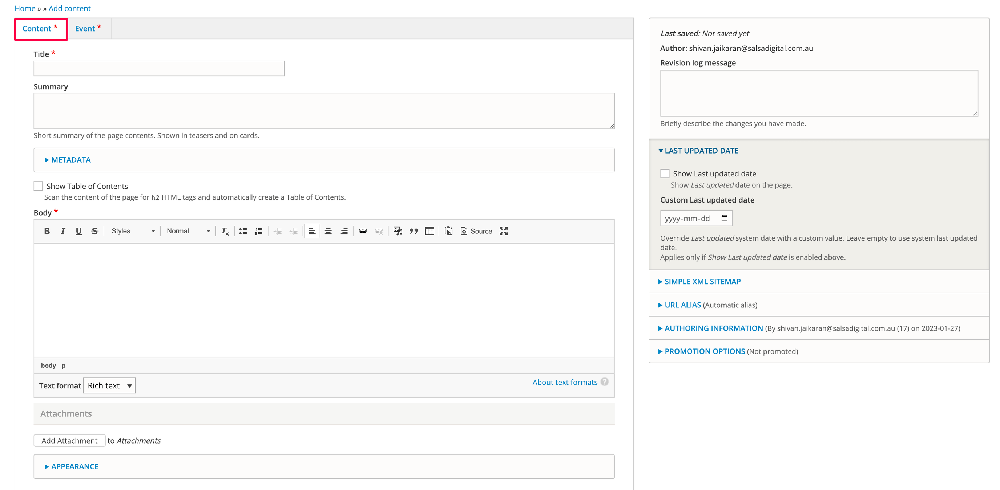

# Page

The Page content type can be used to create most of your website pages.&#x20;

When you add a Page, there are 2 tabs: Content and Banner.

The fields for the Content tab can be seen below:

<figure><figcaption></figcaption></figure>

The fields for the Banner tab can be seen below:

<figure><figcaption></figcaption></figure>

While you can add various components to the page and banner, the most simplistic Page output with a Content component is shown below:

<figure><figcaption></figcaption></figure>
