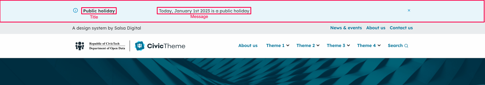
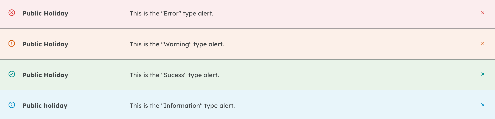

# Alert

Alerts provide information for site users using a horizontal bar at the top of the screen. Common examples are announcements, notices, warnings, downtime alerts or any other alerts that you want your site visitor to see right away at the top of the page.

<figure><figcaption></figcaption></figure>

Depending on which "type" you select, the Alert background colour will be different:

<figure><figcaption></figcaption></figure>

Alerts can be set to appear on all pages on the site or only on selected paths. They can also be scheduled to appear only within a specific date range.

Once a website user dismisses an Alert by pressing on the close Button (x), the alert will no longer appear when a user visits this page again. The alert, however, will be displayed again if the content changes (e.g. if some important information needs to be added to an existing Alert).
