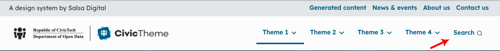

# Custom blocks

CivicTheme comes with several out-of-the-box Custom blocks:

* [Banner block](banner-block.md)
* [Component block](component-block.md)
* [Mobile navigation block](mobile-navigation-block.md)
* [Search block](search-block.md)
* [Social links block](social-links-block.md)

Some custom blocks can be used on a site-wide or a per-page basis, others are created specifically to be used site-wide.

When you create a block it will be saved the Custom block library at`/admin/structure/block/block-content`.

### Examples of custom blocks

The CivicTheme footer uses a two types custom blocks in the footer, 'Component' blocks and a 'Social links' block.

* **Sign up:** 'Component block', using a 'Promo' component
* **Social media links:** 'Social links block'
* **Acknowledgement of Country**: 'Component block', using a 'Content' component
* **Copyright information:** 'Component block', using a 'Content' component

<figure><figcaption>
Fig. 1 - CivicTheme footer using 'Component' custom blocks and 'Social link' custom block
</figcaption></figure>

* **Search:** Search block

<figure><figcaption>
Fig. 2 - Search block used in the header
</figcaption></figure>
