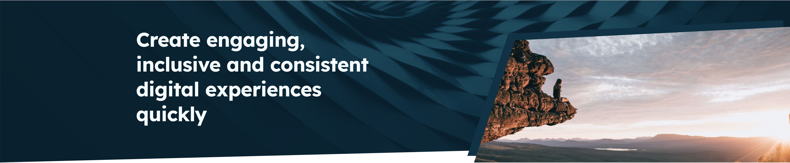
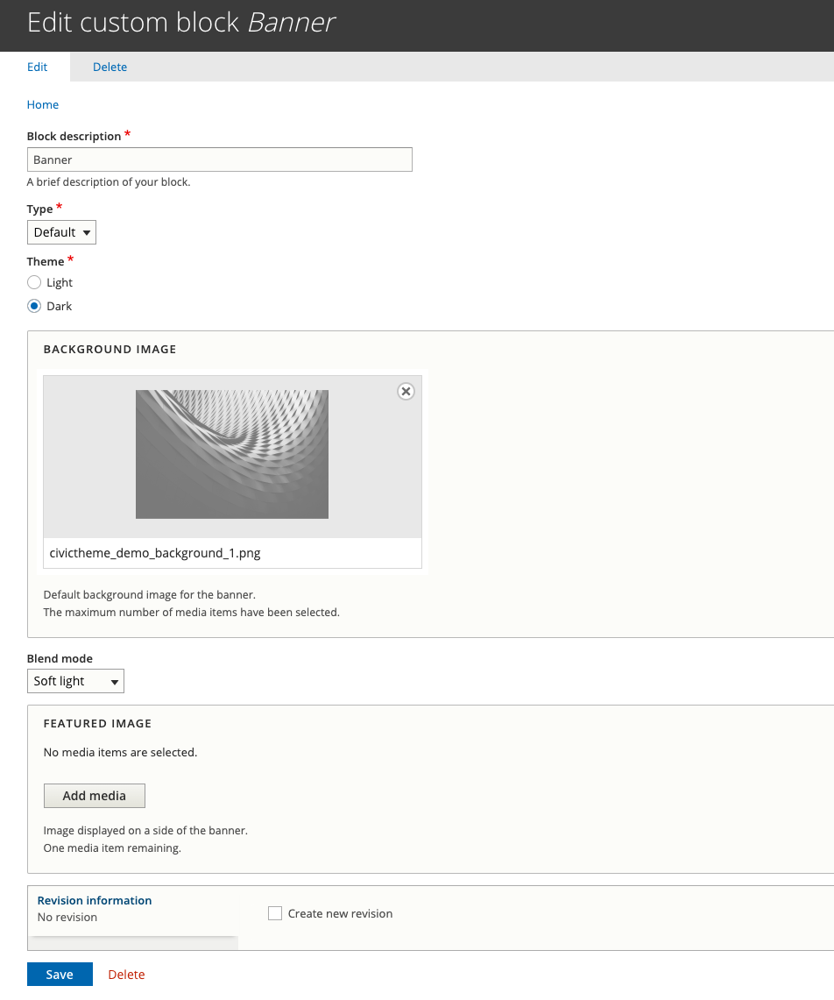
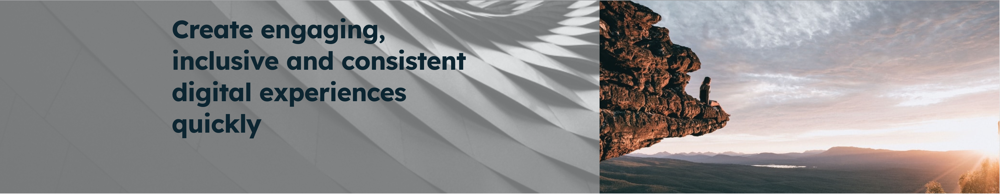

# Banner block

<figure><figcaption>
Site-wide banner with background image and featured image
</figcaption></figure>

### Summary

The site wide-banner is created using a custom 'Banner' block. The block allows you to select an image display type, set a theme, add a background image with an optional blend mode, and a featured image.&#x20;

CivicTheme provides one site-wide banner block out of the box. This banner block is shown on every page by default. You can edit this existing Banner block to use on your site or create a new one.&#x20;

You can override parts of the site-wide banner on a per-page basis. You can also add _banner components_ to the banner on a per-page basis.

Depending on the size of the site you may require more than one site-wide banner block to be used on different sections of the site. If this is the case, the site administrator will need to select which parts of the site to display which banner block.

### Tip

If you create a site-wide banner that includes an image, you can't switch the image off on per-page basis. You can select a different image and override the site-wide image, but if you want only your _landing_ pages to display a banner image and your _content_ or _child_ pages not to, do not include an image in the site-wide banner. Instead, add the image on a per-page basis to your landing pages such as homepage and level 1 landing pages.

### Editing the out of the box site-wide banner

1. Go to Structure > Block layout or `/admin/structure/block/block-content`
2. Select the 'Custom block library' tab.
3.  Look for 'Banner' in the list of blocks (or use the 'Block type' filter and filter for 'Banner') and select 'Edit'.\

    <figure><figcaption>
Fig. 1 - Custom block library
</figcaption></figure>

#### Banner block fields

1. **'Block description'** is the name of the block. It doesn't display anywhere on the website front end. This can be renamed if you wish.
2. **Set the 'Type'.** This will be set to 'Default'. Changing to 'Large' will create a diagonal crop effect on the bottom of the background image and change the shape of the featured image (if you have added one).
3. **Select a 'Theme',** _Light_ or _Dark_. This affects the background image and the text on the banner. **Note:** if you choose to add certain banner components (such as a 'Content' component) to individual page banners whilst still inheriting some aspects of the site-wide banner, you will need to pay attention to the theme you have selected on the site-side banner _and_ the theme you select on the components as the text colour on the banner may be affected.
4. **Add a background image.** By default your CivicTheme site will display a solid colour in the banner background area. The colour will depend on the theme and colours you've chosen for the site. You can override the background colour by adding an image. The theme chosen above will affect this image.&#x20;
5. **Select a 'Blend mode'.** This is optional and creates subtle filters on the background image.
6. **Add a 'Featured image'** if you wish. This will display on the right side of the banner, on top of the background image.

<figure><figcaption></figcaption></figure>

### Creating a new banner block

1. Go to Structure > Block layout or `/admin/structure/block/block-content`
2. Select the 'Custom block library' tab.
3. Click the 'Add custom block' button.
4. Select 'Banner'.
5. Give the block a name in 'Block description' then follow the instructions to edit an existing banner from step 5.

### Example banners

The below banner demonstrates:

1. 'Type' set to 'Large'. Note the diagonal crop effect on the bottom of the background image, the shape of the feature image and the coloured block effect behind it.
2. 'Theme' set to 'Dark'.
3. Background image added.&#x20;
4. 'Blend mode' set to 'Soft light'.
5. 'Featured image' added.

<figure><figcaption></figcaption></figure>

The banner below demonstrates:

1. 'Type' set to 'Default'. Note the effect this has on the background image and the feature image compared to the example above.
2. 'Theme' set to 'Light'. Note the change to the background image and the text colour.&#x20;
3. Background image added. This is the same background image as the example above.
4. 'Blend mode' set to 'None'.
5. 'Featured image' added. This is the same featured image as the example above.

<figure><figcaption></figcaption></figure>
