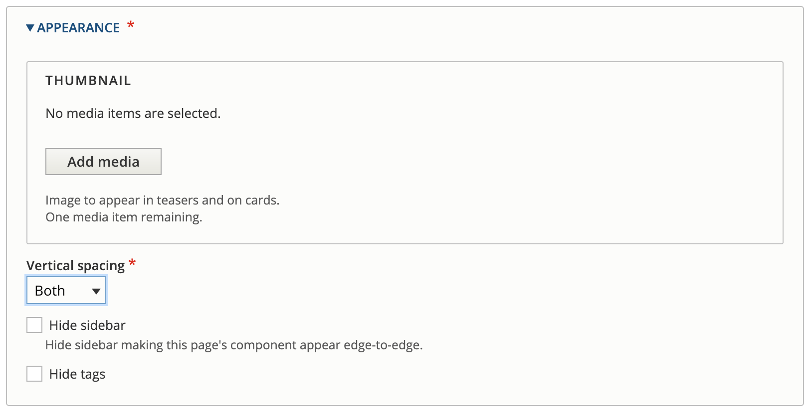

# Page content type

The 'Page' content type is the most flexible content type.&#x20;

This content type allows you to choose from a wide range of CivicTheme out-of-the-box components to build a striking _landing page_ or a simpler _content_ page. The style of the page depends totally on how you use the components.

### Create a Page

1. Go to `/admin/content`
2.  Select `Add content`\

    <figure><figcaption>
Add content
</figcaption></figure>
3.  Select 'Page'\

    <figure><figcaption>
Add Page
</figcaption></figure>

You now have a page with a Content tab and a Banner tab.

### Set up the page essentials

Most fields are empty when the page is first created. There are some compulsory fields that must be filled before you can save the page, and some other important items to configure now.

Note there is a Content tab and a Banner tab. Go to [Banner](configure-the-banner.md) to read more about configuring a per-page banner.

<figure><figcaption>
Content tab on a newly created Page
</figcaption></figure>

1. Add the page title in the Title field
2. Add the Summary. This displays in teasers and within links.&#x20;
3. If you want a 'Table of contents' to display, select the checkbox. The TOC will display at the top of the page.

#### Components

CivicTheme has many out-of-the-box components.&#x20;

Go to [Components](../../components/) to learn how to configure components to build your page.

<figure><figcaption>
Component list
</figcaption></figure>

#### Appearance

Add a thumbnail image, set the vertical spacing, hide sidebar and tags.

<figure><figcaption>
Appearance fields
</figcaption></figure>

#### **Thumbnail**

Add an image for cards and teasers that link to this page. Every time you link to this page using a component that has an image field, it will use this image.

<figure><figcaption>
Thumbnail added
</figcaption></figure>

#### **Vertical spacing**

Vertical spacing allows you to add some extra white space at the top or bottom of the page, or both.

* Top: between the bottom of the banner and top of the H1
* Bottom: above the footer
* Both: both of the above.

Open the Vertical spacing dropdown and select from None, Top, Bottom, Both.

#### **Hide sidebar**

Select this if you want to hide the sidebar. This will cause the content and components to display full width of the page, removing the default gutter, or sidebar, on the left and right sides.

### Menu settings, Last updated date, URL alias and Promotion options

Find these settings on the right side of the interface.

<figure><figcaption></figcaption></figure>

#### Menu settings

To place the page within the site menu, open the 'Menu settings' section. By default the page is not in the menu.

1. Check 'Provide menu link' to open the menu link fields.&#x20;
2. Enter the 'Menu link title'. This is usually the page name and will display in the menus.&#x20;
3. Add a description if you like, this displays when hovering over the menu link.
4. Open the 'Parent link' dropdown and select the _parent_ of this page.&#x20;
5. The 'Weight' determines the order in which each page displays below their parent page. The lower the weight the higher the position in the menu. You can also configure the order of the site menu in `/admin/structure/menu`.

<figure><figcaption>
Menu settings
</figcaption></figure>

#### Last updated date

By default the 'Last updated date' is checked to display on the page. It will automatically display the last published date. Uncheck the box if you don't want to display the last updated date.

If you want to customise the date, use the date picker.

#### URL alias

The URL alias is set to generate automatically. It uses the page title and the menu structure to create the URL alias.

To override the automatic URL alias, uncheck the box and add the alias to the URL alias field.

#### Authoring information

Automatically records who created the page and on which date. There is usually no need to modify this setting.

#### Promotion options

Promote to the front page (homepage) to display a teaser or card and stick at the top of lists.&#x20;

<figure><figcaption>
Promotion options
</figcaption></figure>

