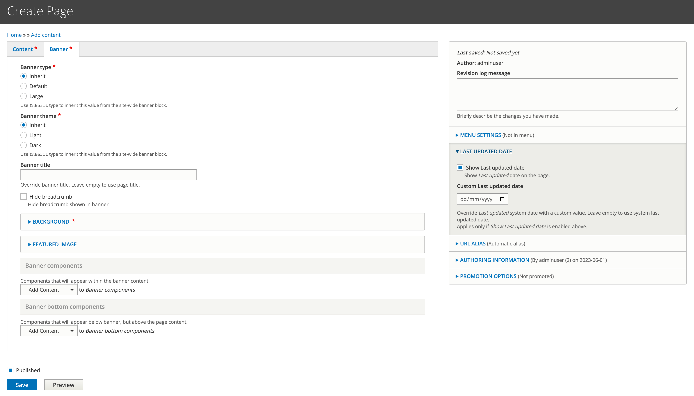
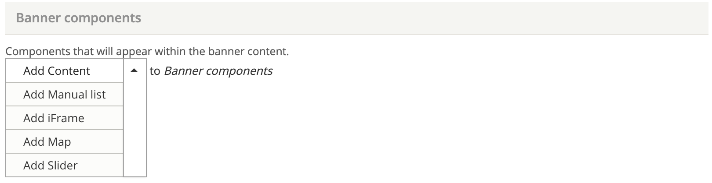
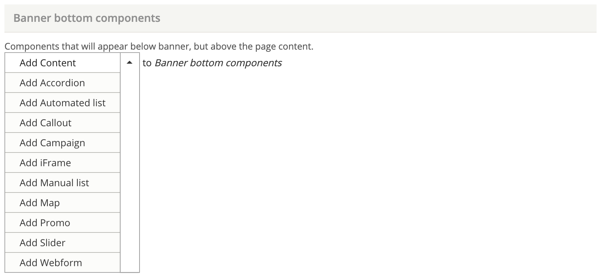

# Configure the banner

Select the 'Banner' tab to customise the banner on a per-page basis.

By default all pages on your site will inherit the site-wide banner settings.&#x20;

<figure><figcaption>
Banner configuration fields
</figcaption></figure>

### Banner type and Banner theme&#x20;

Refer to the [site-wide banner](../../site-wide-configuration/banner.md) settings page for explanations and examples of these banner features.&#x20;

If you want to deviate from either of these site-wide settings, select the relevant radio button.

### Override the Banner title

You can override the title that displays in the banner by entering a new title in the 'Banner title' field.

Adding a Banner title doesn't override the breadcrumb or the URL alias. They will use the Page title unless you manually configure them differently.

### Hide breadcrumb

The breadcrumb displays by default. Check 'Hide breadcrumb' to hide it.

### Background

Your site will inherit the site-wide background. If you want to change this on your page, open the Background widget and upload a new background. You can also update the 'Blend mode' on the background.&#x20;

### Featured image

If your site-wide banner has a Featured image, it means that every child page will have a Featured image, you can't remove the featured image on a per-page basis. However you can change the image on a per-page basis in the 'Featured image' widget.

If there are any pages you don't want a Featured image on, you will need to ensure your site-wide banner does not have a Featured image.

### Add components to the banner

There are two types of components you can add to the banner. 'Banner components' which display on the banner itself. And 'Bottom banner components' which display below the banner.

Go to the [Components](../../../development/ui-kit/extending-components.md) section of the manual to learn how to configure each component.

#### Banner components

You can add the following components to the banner and they will display within the banner itself:

* [Content](../../components/content.md)
* [Manual list](../../components/manual-list/)
* [iFrame](../../components/iframe.md)
* [Map](../../components/map.md)
* [Slider](../../components/slider.md)

<figure><figcaption>
Available Banner components
</figcaption></figure>

#### Bottom banner components

You can add the following components to the bottom of the banner.

* [Content](../../components/content.md)
* [Accordion](../../components/accordion.md)
* [Automated list](../../../development/drupal-theme/automated-list.md)
* [Callout](../../components/callout.md)
* [Campaign](../../components/campaign.md)
* [iFrame](../../components/iframe.md)
* [Manual list](../../components/manual-list/)
* [Map](../../components/map.md)
* [Promo](../../components/manual-list/promo-card.md)
* [Slider](../../components/slider.md)
* [Webform](../../components/webform.md)

<figure><figcaption>
Available Bottom banner components
</figcaption></figure>
