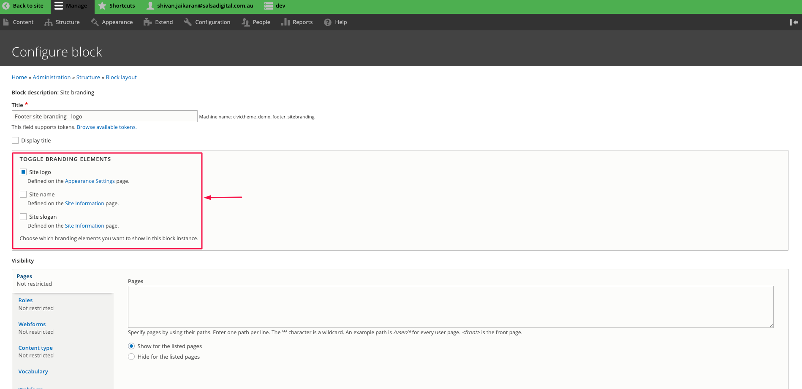
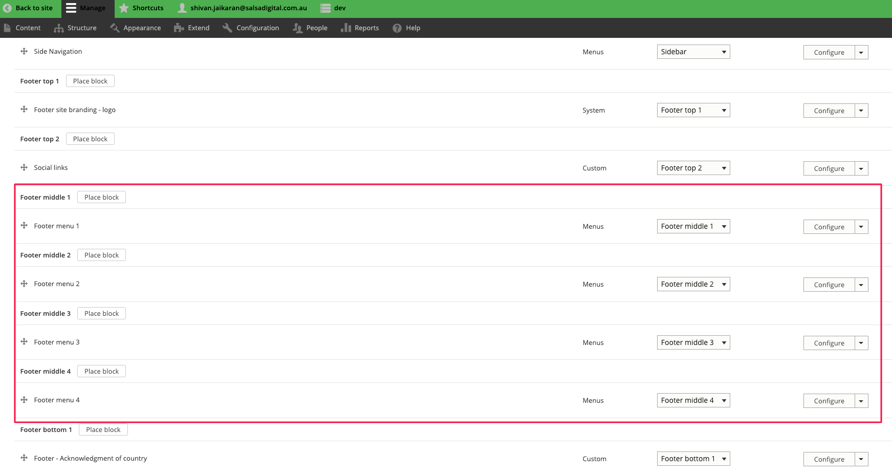

# Footer

### Summary 

This article will guide you on how to update the footer section of your site.

The footer section comprises 5 blocks and a menu as shown in Figure 1.

### Signup block 

The signup block is a custom block of type “Component”.

To edit this block:

1.  Go to Structure >> Block layout >> Custom block library\
    The URL is _\[your\_site]/admin/structure/block/block-content_\
    Then click on “Edit” next in the row of the Signup block.

    
2.  On the block edit page, you can update the text fields as needed.\

### Footer site branding block 

This block is a Drupal system block and is provided by default with Drupal.

To edit this block:

1. Go to Structure >> Block layout and find the section “Footer top 1”.\
   The URL is _\[your\_site]/admin/structure/block_
2.  Click on “Configure”.

    3\. On the “edit” screen, you can toggle the branding elements to be shown.\

    

### Social links custom block 

The social links block is a custom block of type “Social Links”.

To edit this block:

1.  Go to Structure >> Block layout >> Custom block library\
    The URL is _\[your\_site]/admin/structure/block/block-content_\
    Then click on “Edit” next in the row of the Social link block.

    
2.  On the “edit” screen, you can update the icons.\

### Footer menu 

The Footer is one menu but it is split into 4 sub menus at the block level.

First, here is how to access the entire menu:

1.  Go to Structure >> Menus and click on “Edit menu” in the same row as the Footer menu.\
    The URL is _\[your\_site]/admin/structure/menu_

    
2.  On the “edit” screen, you can update the menus as needed. Notice the hierarchy as this is important for the splitting of the menus in the next step. Essentially, each submenu has a parent and child menus. You can drag/drop the handles to rearrange the menu items.\

The final output is shown in Figure 10.

Now let’s demonstrate how these 4 blocks are set up.

1. Go to Structure >> Block layout\
   The URL is _\[your\_site]/admin/structure/block_
2.  Find the Footer middle 1, Footer middle 2, Footer middle 3 and Footer middle 4 regions. In each of these regions, we have placed the **same Footer menu** but the configuration of each is what changes the output.\

    
3.  Click on “Configure” for Footer menu 1. As shown in Figure 12, we have set the parent item to “About Us”. So this menu block will only show child menu items of the “About Us” parent menu. The same technique applies to Footer menu 2, Footer menu 3 and Footer menu 4. The setting of the “Parent” is crucial and it differs for each menu block.\

### Footer text blocks 

There are 2 footer text blocks of type “Component” and they can both be updated in the same way.

Firstly, these 2 text blocks are custom blocks and they are placed into Footer bottom 1 and Footer bottom 2 regions. You can find these block placements at Structure >> Block layout

To edit these blocks:

1.  Go to Structure >> Block layout >> Custom block library\
    The URL is _\[your\_site]/admin/structure/block/block-content_\
    Here you can see the 2 text blocks.\

2.  Click on “Edit” for either block. Then update the text as needed and click on Save.\

### Tip 

There are some extra Footer settings that can be updated from within the CivicTheme configuration. [Please read our documentation here about that](broken-reference).
