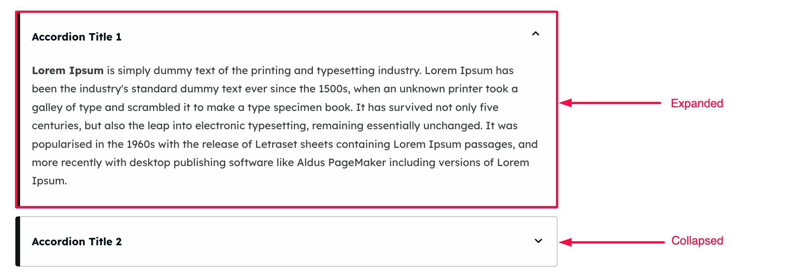
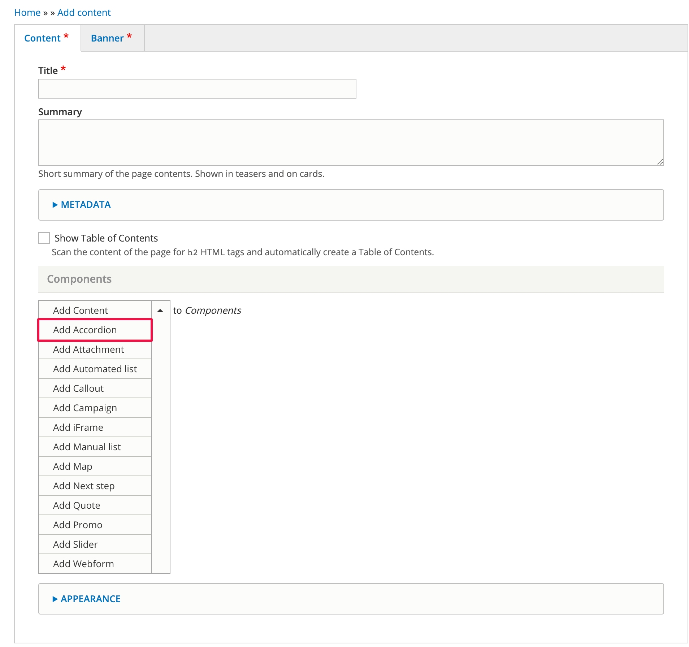
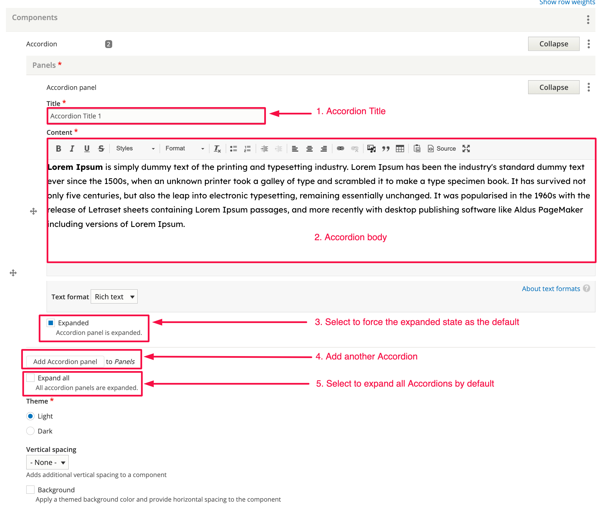

# Accordion

### Summary

The Accordion component allows you to add collapsible sections of content. You can specify the default state (expanded or collapsed) in the Accordion settings.&#x20;

This section shows you how to add accordions.&#x20;

Below you can see two accordions, one in its expanded form, and the other one collapsed.&#x20;

### Step 1 - Add the Accordion component 

Click on “Add Accordion” as shown below.

### Step 2 - Add an Accordion 

Add content for your Accordion using the fields shown below.

1. Accordion title - Add the title.
2. Content - Add the body text.
3. Expanded - Check this box to force the Accordion to be expanded by default.
4. Add another Accordion - Click this button to add additional Accordions.
5. Expand all - Check this box to force all Accordions to be expanded by default.
