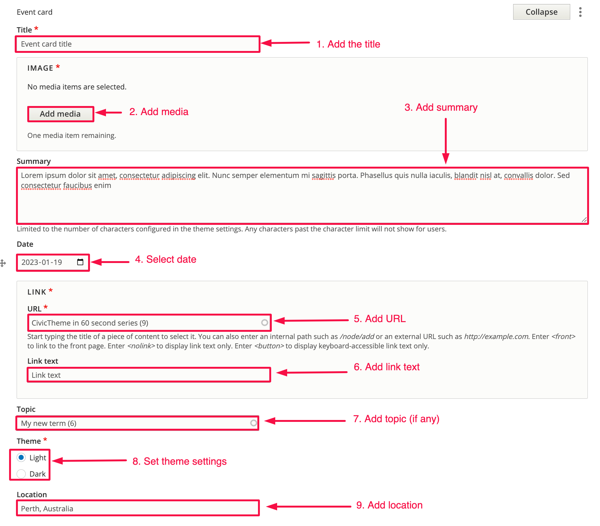

# Event card

### Summary 

This article will guide you how to add an Event card sub-component to your Manual list component.

The Event card consists of a title, image, summary, date, URL, link text, topic (taxonomy term) and location.

Figure 1 shows one Event card.

### Step 1 - Add the Event card 

Inside of your Manual list component under List items, click on the dropdown and select Event card as shown in Figure 2.

Figure 3 shows the various fields which are numbered and highlighted.

Most of the highlighted fields are simple self-explanatory text fields. Some of the non-text fields are explained below.

4\. Date - you can click on the calendar icon to select a date from the popup date widget.

5\. URL - This is an autocomplete field. Start by typing the title of the internal page content type or enter an external URL.

6\. Topic (optional) - This is an autocomplete field. Terms must first exist in your Topics vocabulary which is located at: _\[your\_site]/admin/structure/taxonomy/manage/civictheme\_topics/overview_

### Tip 

You can configure the number of Event cards in one row by adjusting the “Column count” under the “Appearance“ tab as shown in Figure 4.

