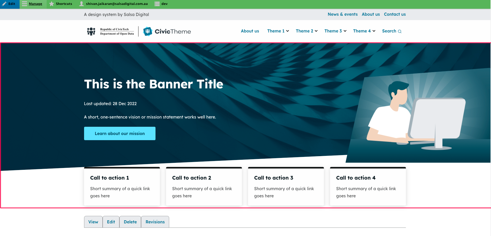

# Banner

### Summary 

This article will guide you on how to update the sitewide banner on any page.

### Where is the site-wide banner? 

The site-wide banner is the entire section just below the header section.

<figure><figcaption></figcaption></figure>

