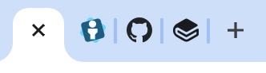
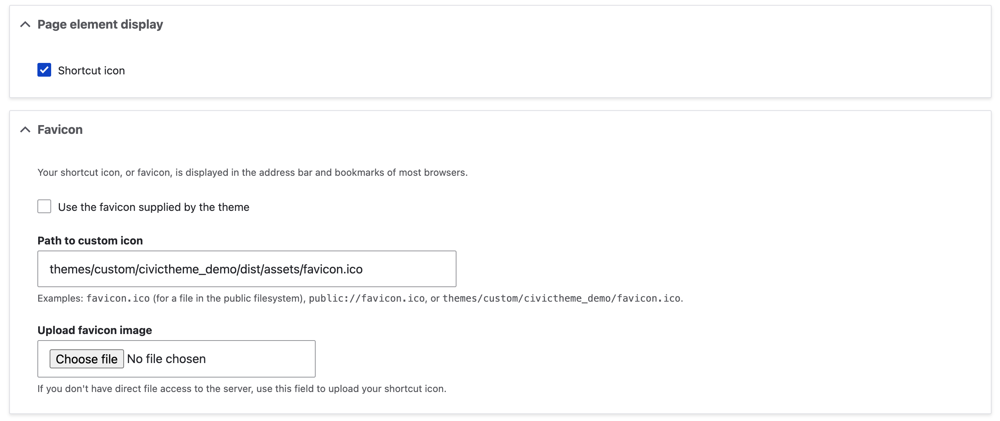

# Favicon

The Favicon is used in the browser tab. It's the small icon which is often a representation of the logo of brand.

<figure><figcaption></figcaption></figure>

<figure><figcaption></figcaption></figure>

### Add / update a Favicon to your site

1. Go to the theme settings page `/admin/appearance/settings/<site-name>`
2. Find the 'Page element display' at the top of the page and ensure the checkbox is filled (the 'Favicon' section won't display if the 'Page element display' box isn't filled).
3. Then do one of the following
   1. Check the box the 'Use the favicon supplied by the theme'
   2. Paste the relative path in the 'Path to custom icon'
   3. Select `Choose file` to upload a new favicon.

<figure><figcaption></figcaption></figure>
