# Footer

Some footer settings, such as adding a background image and choosing the light or dark theme are configured in the Settings area of your site. Go to [Footer settings](theme-settings/footer-settings.md) for more information on theme settings.&#x20;

The remainder of the footer is created using custom blocks and menus.&#x20;

**Note:** In the example below, the 'Sign up' section is not part of the footer. It's a 'Custom block' that been added to the 'Component bottom' section of the site, making it a site-wide component and appearing like part of the footer.

The footer example below contains the following custom blocks:

* _Component custom_ block, used for:
  * &#x20;Sign up
  * Acknowledgement of Country
  * Copyright
* _Social links_ custom block, used for Social links
* _System_ block, used for the Logo.

<figure><figcaption>
CivicTheme footer
</figcaption></figure>

### Signup block 

The signup block is a custom 'Component' block.

To edit this block:

1. Go to Structure > Block layout > Custom block library or `/admin/structure/block/block-content`
2.  Select “Edit” in the row of the Signup block.

    <figure>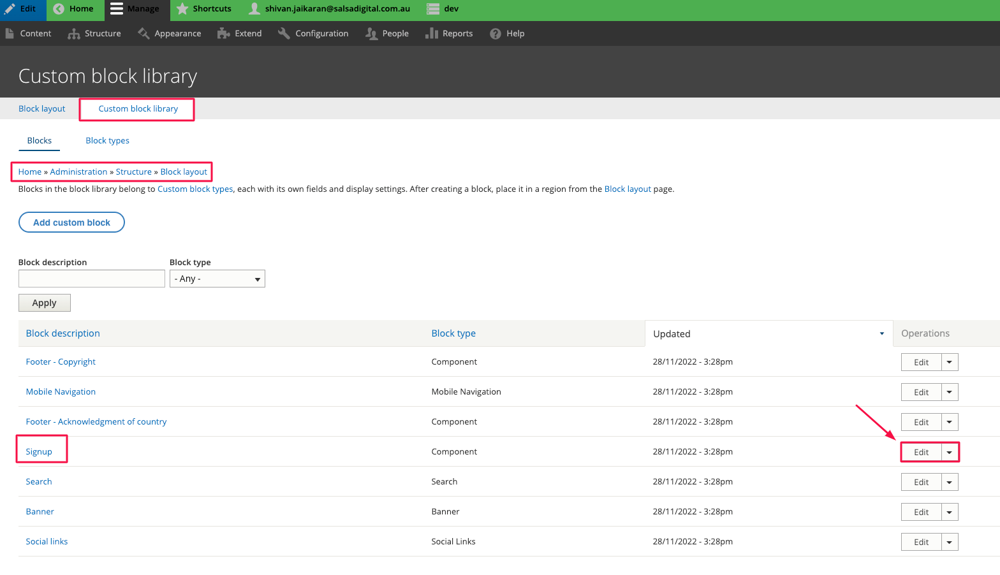<figcaption></figcaption></figure>
3. On the block edit page, you can update the text fields as needed.

<figure>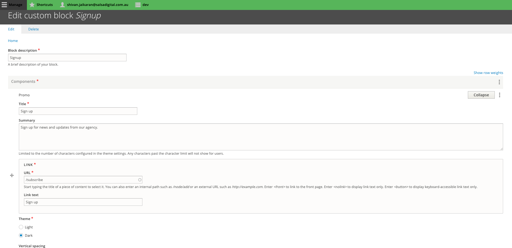<figcaption></figcaption></figure>

### Footer site branding block 

This block is a Drupal system block and is provided by default with Drupal.

To edit this block:

1. Go to Structure >> Block layout and find the section “Footer top 1”.\
   The URL is _\[your\_site]/admin/structure/block_
2.  Click on “Configure”.

3.  On the edit screen, you can toggle the branding elements that you want displayed in the footer.\

    <figure>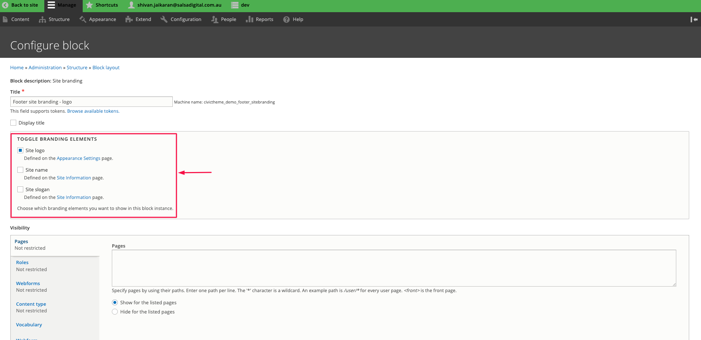<figcaption></figcaption></figure>

### Social links custom block 

Go to [Social links block](../content/custom-blocks/social-links-block.md) to learn how to build and configure a Social media links section for your site.

### Footer menu 

The Footer is one menu but it's split into 4 submenus at the block level.

First, here is how to access the entire menu:

1.  Go to Structure >> Menus and click on “Edit menu” in the same row as the Footer menu.\
    The URL is _\[your\_site]/admin/structure/menu_

    <figure>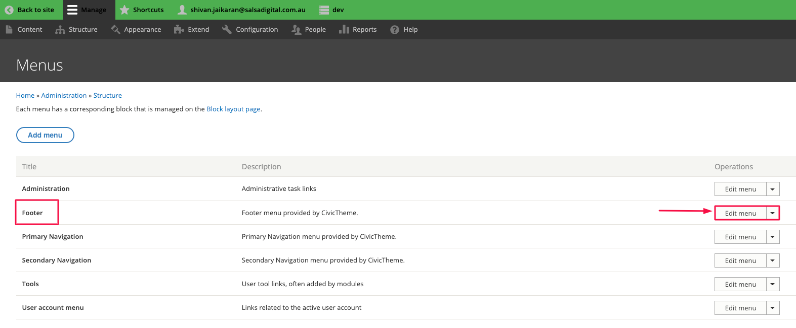<figcaption></figcaption></figure>
2. On the edit screen, you can update the menus as needed. Notice the hierarchy, as this is important for splitting the menus in the next step. Essentially, each submenu has a parent and child menus. You can drag/drop the handles (they look like a plus sign with arrows) to rearrange the menu items.

<figure>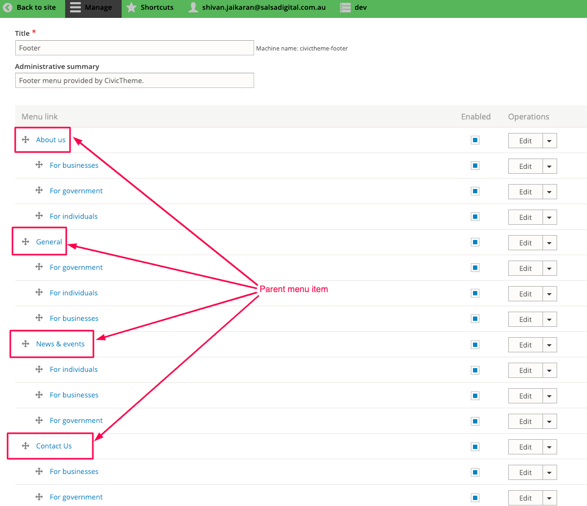<figcaption></figcaption></figure>

The final output:

<figure>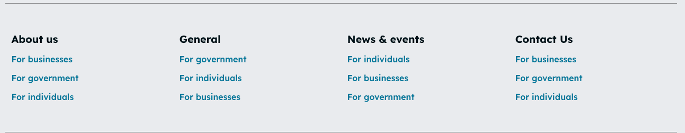<figcaption></figcaption></figure>

Now let’s demonstrate how these 4 blocks are set up.

1. Go to Structure >> Block layout\
   The URL is _\[your\_site]/admin/structure/block_
2.  Find the Footer middle 1, Footer middle 2, Footer middle 3 and Footer middle 4 regions. In each of these regions, we have placed the **same Footer menu** but the configuration changes the output.\

    <figure>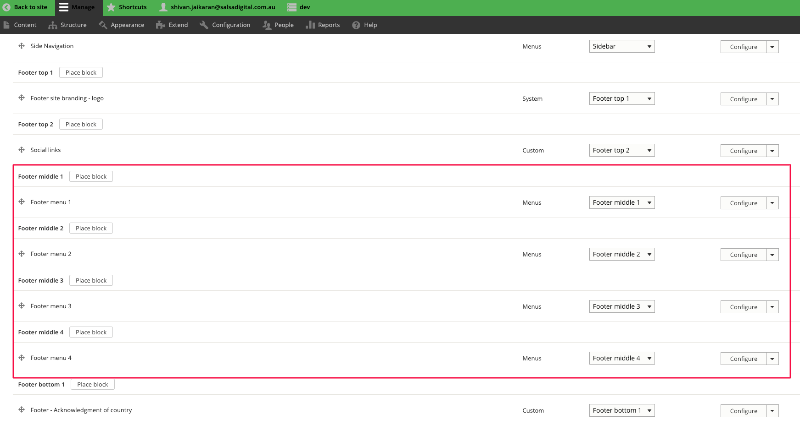<figcaption></figcaption></figure>
3. Click on “Configure” for Footer menu 1. As shown below, we have set the parent item to “About us”. So this menu block will only show child menu items of the “About us” parent menu. The same technique applies to Footer menu 2, Footer menu 3 and Footer menu 4. The setting of the “Parent” is crucial and it differs for each menu block.

<figure>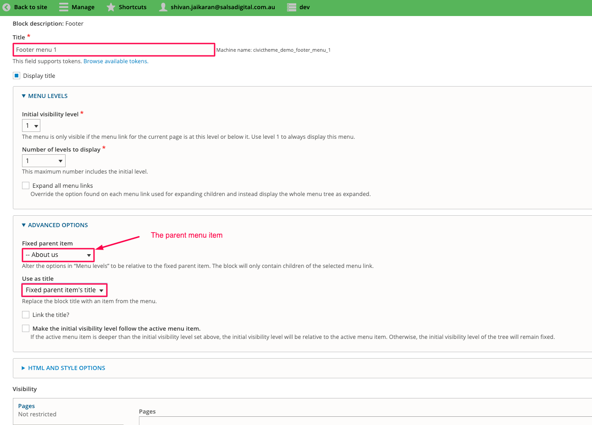<figcaption></figcaption></figure>

### Footer text blocks 

There are 2 footer text blocks of type “Component” and they can both be updated in the same way.

Firstly, these 2 text blocks are custom blocks and they are placed into Footer bottom 1 and Footer bottom 2 regions. You can find these block placements at Structure >> Block layout

<figure>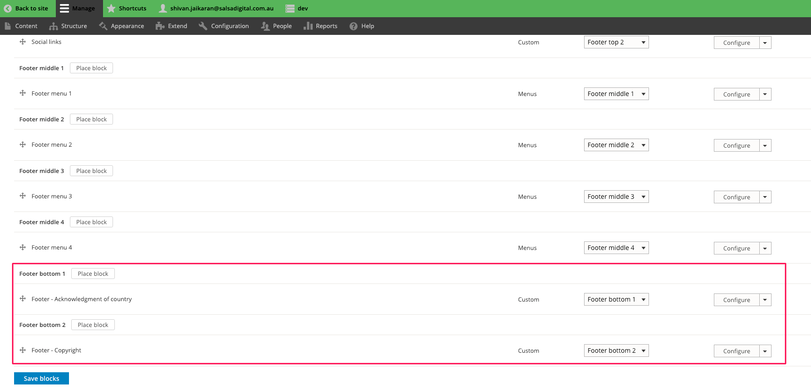<figcaption></figcaption></figure>

To edit these blocks:

1. Go to Structure >> Block layout >> Custom block library\
   The URL is _\[your\_site]/admin/structure/block/block-content_\
   Here you can see the 2 text blocks.

<figure>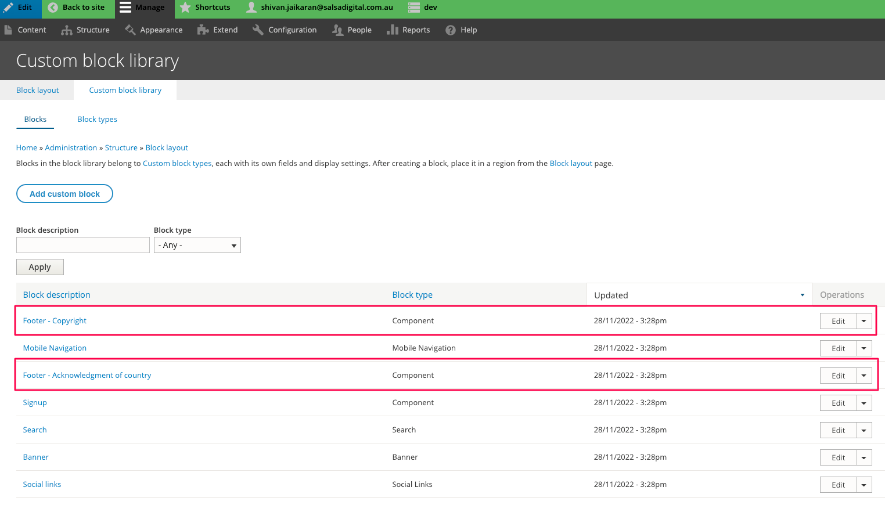<figcaption></figcaption></figure>

2. Click on “Edit” for either block, then update the text as needed and click on Save.

<figure>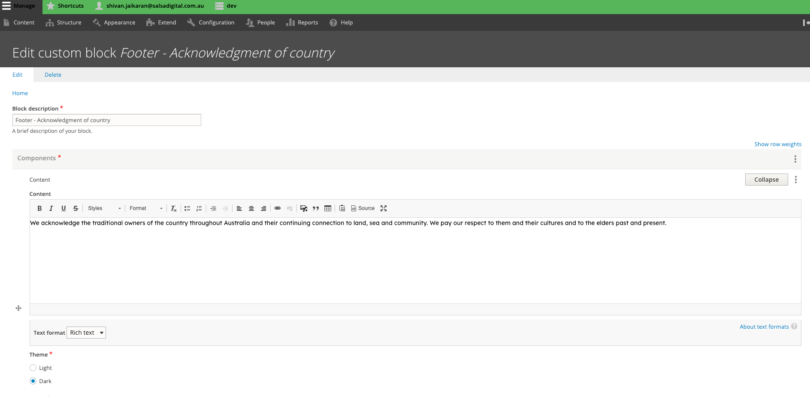<figcaption></figcaption></figure>

### Tip 

There are some extra Footer settings that can be updated from within the CivicTheme configuration. [Please read our documentation about extra Footer settings](broken-reference).
