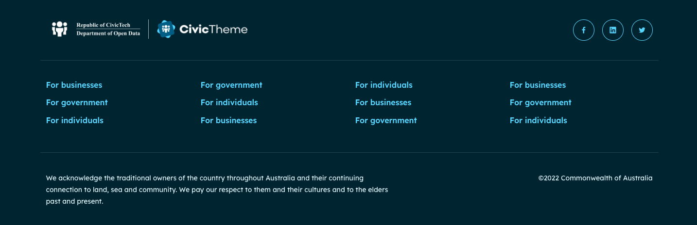
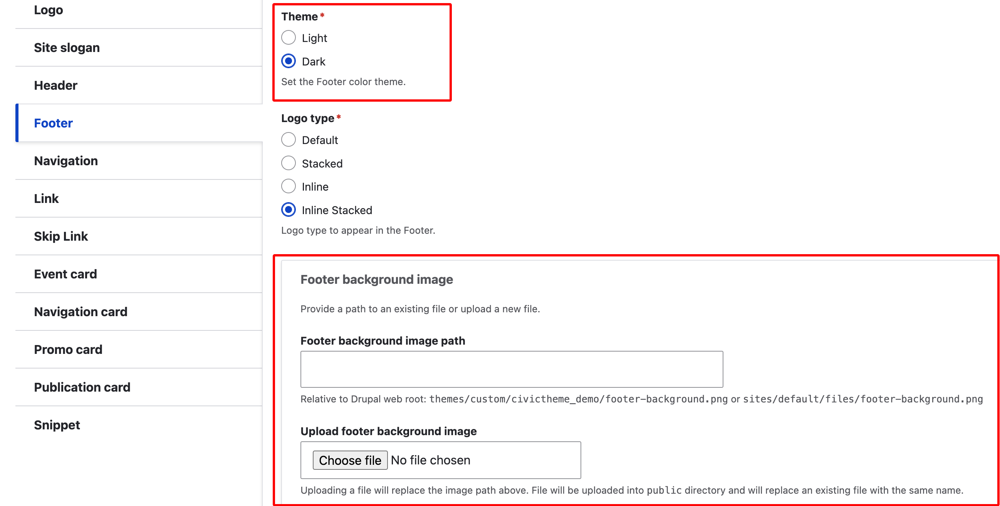
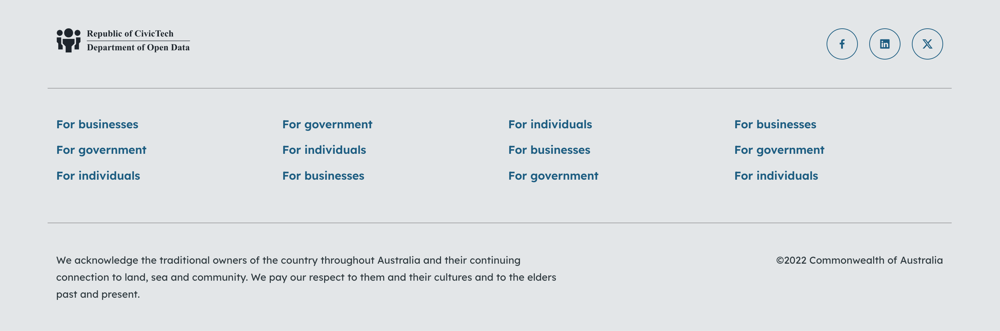
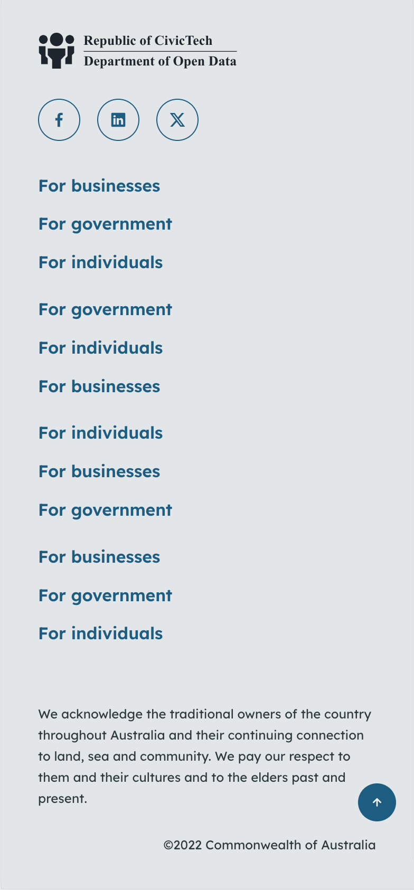
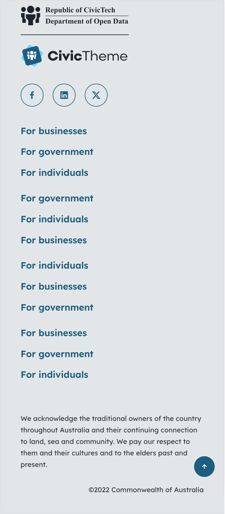

# Footer

The Footer is a global element that sits at the bottom of every page on your site. Common Footer elements are Logo/s, Social links, Footer navigation, Acknowledgement of Country, Copyright and Privacy information.&#x20;

The Footer is created using a series of Blocks.  Build your footer using Block types of "Component", "Social Links" and "System".

Some Blocks used in the Footer area available out of the box. You can configure certain settings to suit.

<figure><figcaption></figcaption></figure>

### Create Blocks

Before you can build your Footer you need to create all the blocks that will make up the Footer.

From the list below, follow the steps to create the Blocks you wish to use.&#x20;

The instructions on how to place the Blocks in the correct region are on each page.

* [Footer logo](footer-logo.md)
* [Social links](social-links-block.md)
* [Footer navigation](footer-navigation.md)
* [Acknowledgement of Country](acknowledgement-of-country.md)
* [Copyright](copyright.md)

### Configuring the footer 

You will need to be logged in as the "Site Administrator" role.

1. Go to  `/admin/appearance/settings/<site-name>` or Appearance in the menu, find your site and select "Settings".
2. Scroll down the page until you see the "Components" section, and select "Footer".

#### Theme

Use the Theme radio buttons to set the footer in Light or Dark theme.

**Note:** the Theme you set here for the global Footer configuration must match the Theme you set on the Blocks you're using to create the Footer. For example, you must set the "Social links" Block to `Dark` if you set your Footer Theme to `Dark`.

#### Background

You can choose to display a background image on your footer. However, keep in mind that a detailed image could create issues with accessibility if the written content in the footer can't be read on top of the image.&#x20;

1. In the "Footer background image path" section, upload a background image, or paste in the path to the image if it's already in the media library.

<figure><figcaption>
Footer configuration
</figcaption></figure>

<figure><figcaption>
Footer with Background image
</figcaption></figure>

### **Footer examples**

**Note:** The footer column headings are switched off in these examples, further screenshots to come to illustrate the footer column headings.

#### Light theme Default desktop

<figure><figcaption>
Light theme desktop Footer with Logo set to Default
</figcaption></figure>

#### Light theme Default mobile

<figure><figcaption>
Light theme mobile Footer with Logo set to Default
</figcaption></figure>

#### Light theme Stacked desktop

<figure><figcaption>
Light theme desktop Footer with Logo set to Stacked
</figcaption></figure>

#### Light theme Stacked mobile

<figure><figcaption>
Light theme desktop Footer with Logo set to Stacked
</figcaption></figure>

#### Dark theme Inline desktop

<figure><figcaption>
Dark theme desktop Footer with Logo set to Inline
</figcaption></figure>

#### Dark theme Inline mobile

<figure><figcaption>
Dark theme mobile Footer with Logo set to Inline
</figcaption></figure>

#### Dark theme Inline stacked desktop

<figure><figcaption>
Dark theme desktop Footer with Logo set to Inline stacked
</figcaption></figure>

#### Dark theme Inline stacked mobile

<figure><figcaption>
Dark theme mobile Footer with Logo set to Inline stacked
</figcaption></figure>

