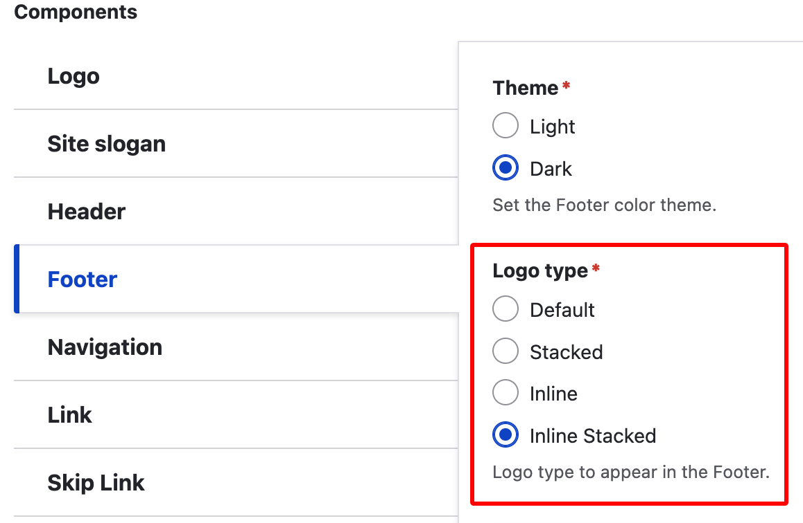

# Footer logo

### This page is in development.

1. Go to  `/admin/appearance/settings/<site-name>` or Appearance in the menu, find your site and select "Settings".
2. Scroll down the page until you see the "Components" section, and select "Footer".
3. Select from the "Logo type" options:
   * Default
   * Stacked (requires two logos)
   * Inline
   * Inline stacked (requires two logos)

<figure><figcaption></figcaption></figure>

| **Logo type**                                                                                                                    | **Final output (desktop)**                   | **Final output (mobile)**                    |
| -------------------------------------------------------------------------------------------------------------------------------- | -------------------------------------------- | -------------------------------------------- |
| 
<strong>Default</strong> Uses the Primary logo only
                                                                    |  |  |
| 
<strong>Stacked</strong> Uses both the Primary &#x26; Secondary logos
                                                  |  |  |
| 
<strong>Inline</strong> Desktop uses both Primary &#x26; Secondary. Mobile uses Primary only.
                       |  |  |
| 
<strong>Inline stacked</strong> Desktop (inline) &#x26; mobile (stacked) both use both Primary &#x26; Secondary logos.
 |  |  |
