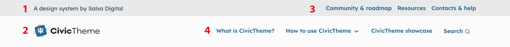
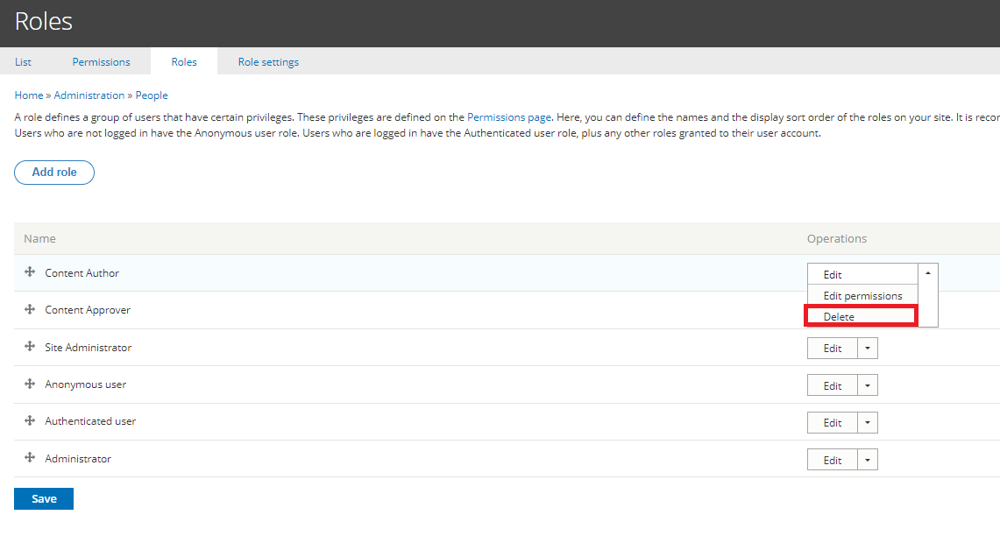
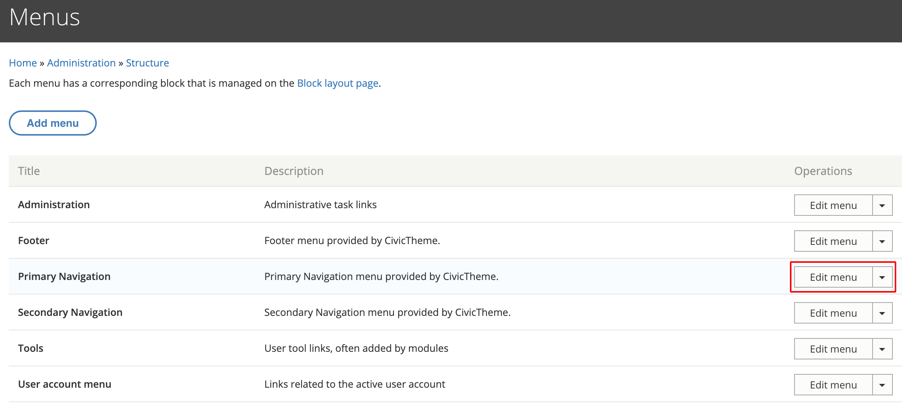

# Header

### Summary 

The header section appears at the top of your website. It comprises:

1. The site slogan
2. The primary and secondary logos (this example illustrates a primary logo only)
3. The secondary menu
4. The primary menu

Some of the settings for the header are configured in the 'Settings' section of your CivicTheme site such as [Theme and Logo settings](theme-settings/header.md), others are configured in the 'Structure' section.

<figure><figcaption>
Fig. 1 - 'Light' theme header
</figcaption></figure>

<figure><figcaption>
Fig. 2 - 'Dark' theme header
</figcaption></figure>

### Site slogan

The Site slogan is optional. This is configured in the Settings area. See [Site slogan](theme-settings/site-slogan.md) for instructions.

### Update the primary and secondary logos 

There are a couple of steps to configure the logo/s:

1. [Add your logos](theme-settings/logo.md#updatinglogos-step3-updatingtheprimarylogo) to the site.
2. [Configure the logos](theme-settings/header.md#header-logotype) in the header settings (select the 'Light' or 'Dark' theme, and choose how the logo displays in the header on desktop and mobile).

### Update the menus 

#### Secondary menu 

1. Go to `/admin/structure/menu/manage/civictheme-secondary-navigation` or Structure > Menus
2.  Select 'Edit menu' for the Secondary navigation \

    <figure><figcaption></figcaption></figure>
3.  Select 'Add link' to add a new link or click on “Edit” next to an existing link to update it.

    <figure><figcaption>
Edit the Secondary menu
</figcaption></figure>
4. Whether you clicked on “Add link” or “Edit”, you will be presented with the edit screen. Fill in the various fields and then click on “Save”.

#### Primary menu 

Updating the Primary menu is similar to updating the secondary menu as in the previous section.

Follow the instructions above, but select 'Edit menu' for the Primary menu instead.

<figure><figcaption>
Menus
</figcaption></figure>
