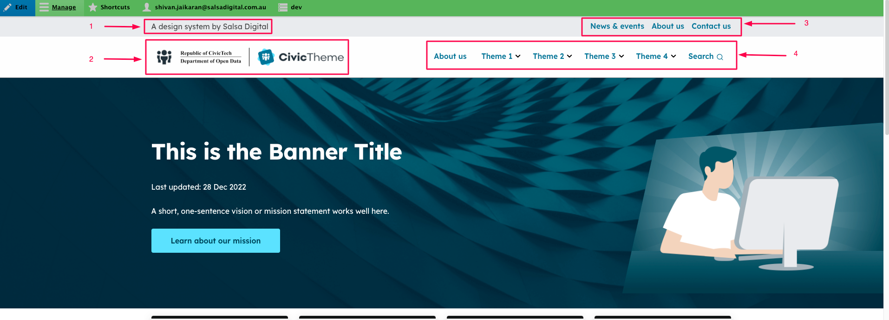
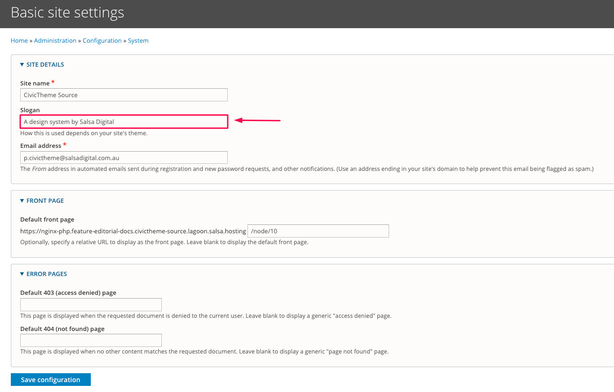
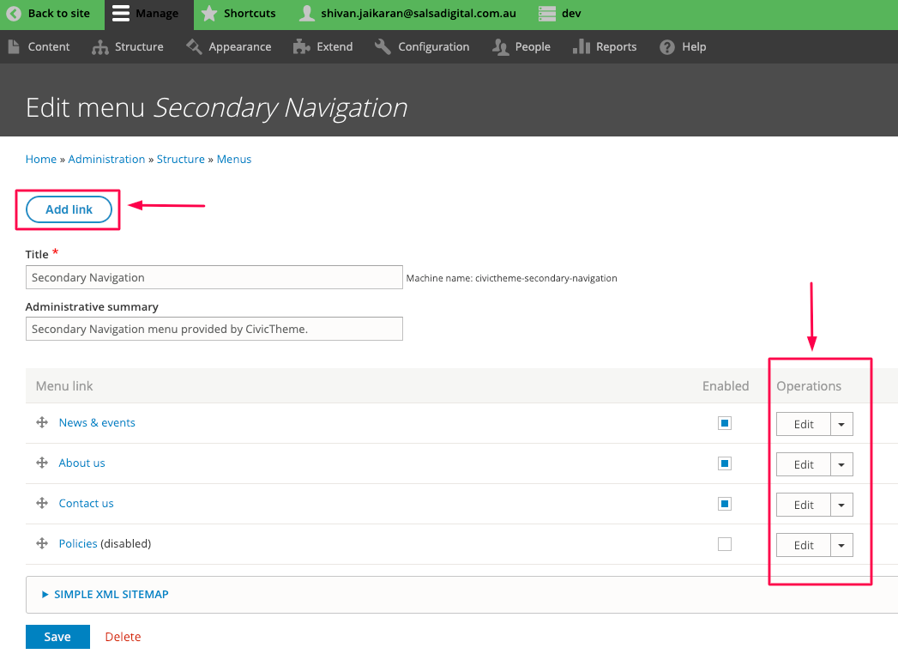
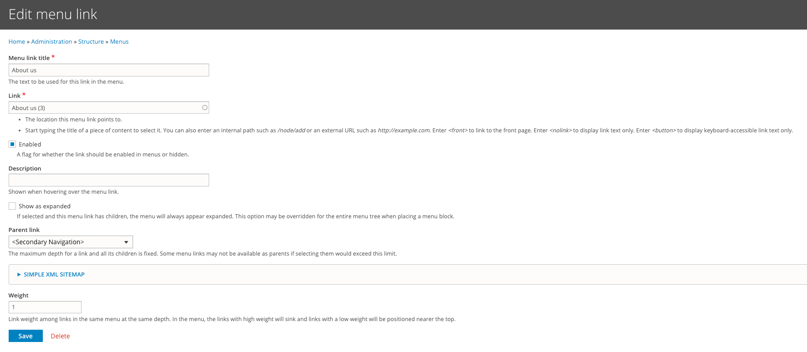
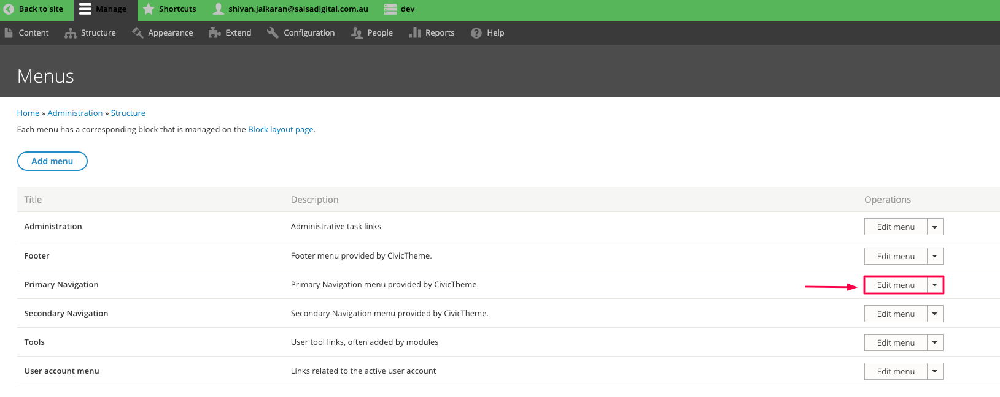

# Header

### Summary 

The header section appears at the top of your website.&#x20;

This article shows you how to update the header section of your site.

The header section comprises of 4 subsections:

1. The site slogan
2. The primary and secondary logos
3. The secondary menu
4. The primary menu

<figure><figcaption></figcaption></figure>

### 1. Updating the site slogan 

a. Go to `/admin/config/system/site-information` __ or click on Configuration > Basic site settings

b. Update the text in the Slogan field and click on the "Save configuration" button.

<figure><figcaption></figcaption></figure>

### 2. Updating the primary and secondary logos 

Read [documentation](theme-settings/logo.md) on how to update Header and Footer logos.

### 3. Updating the Secondary menu 

a. Go to `/admin/structure/menu/manage/civictheme-secondary-navigation` or Structure > Menus and then click on “Edit menu” next to Secondary navigation.

<figure><figcaption></figcaption></figure>

b. Click on “Add link” to add a new link or click on “Edit” next to an existing link to update it.

<figure><figcaption></figcaption></figure>

Whether you clicked on “Add link” or “Edit”, you will be presented with the edit screen. Fill in the various fields and then click on “Save”.

<figure><figcaption></figcaption></figure>

### 4. Updating the Primary menu 

Updating the Primary menu is similar to updating the secondary menu as in the previous section.

a. Go to `/admin/structure/menu/manage/civictheme-primary-navigation` or Structure > Menus and then click on “Edit menu” next to Primary navigation.

<figure><figcaption></figcaption></figure>

b. See Section 3b on this page and follow the same pattern to update the menu links.

### Tip 

There are some extra Header settings that can be updated from within the CivicTheme configuration. [Please read our documentation on extra Header settings](broken-reference).
