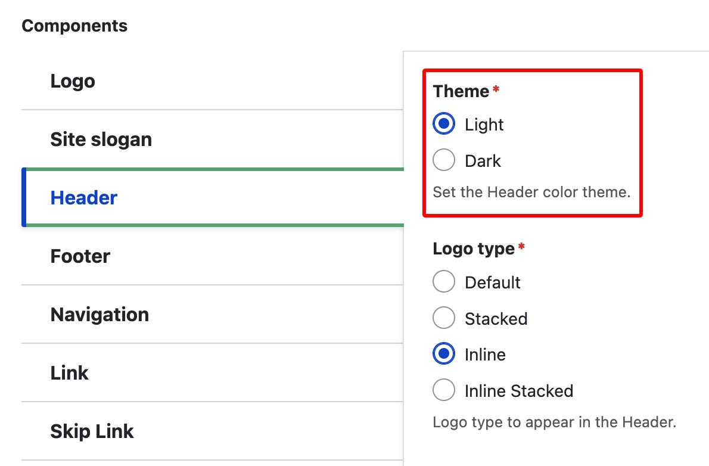
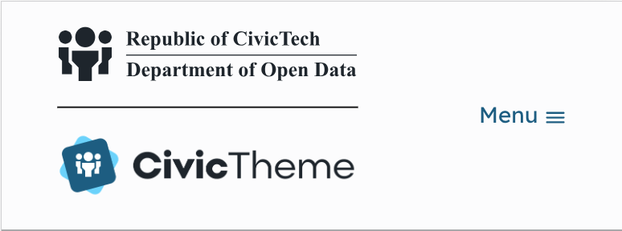
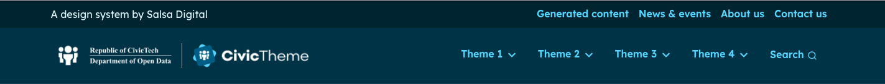

# Header

The header section appears at the top of your website. It comprises:

1. [Site slogan](site-slogan.md)
2. [Header logos](logo.md)
3. [Secondary navigation](seconday-navigation.md)
4. [Primary navigation](navigation.md)

### Configuring the Header

When you apply the Theme, it's applied to all four above mentioned sections of the header.

To apply the `Light` or `Dark` theme to the Header go to `/admin/appearance/settings/<site-name>` and use the radio buttons.

In this section you can also configure the Logo type.

<figure><figcaption></figcaption></figure>

### Header examples

The examples below illustrate the `Light` and `Dark` theme applied to the header.

**Note:** the below examples only illustrate the Light and Dark theme, these don't give examples of the Header logo options. Go to the [Header logo](logo.md) page for more logo examples.

#### Light theme desktop

<figure><figcaption>
Light theme desktop Header with Logo set to Default
</figcaption></figure>

#### Light theme mobile

<figure><figcaption>
Light theme mobile Header with Logo set to Default
</figcaption></figure>

<figure><figcaption>
Light theme mobile Header with Logo set to Stacked
</figcaption></figure>

#### Dark theme Inline (logo) desktop

<figure><figcaption>
Dark theme desktop Header with Logo set to Inline
</figcaption></figure>

#### Dark theme Inline (logo) mobile

<figure><figcaption>
Dark theme mobile Header with Logo set to Inline
</figcaption></figure>

#### Dark theme Inline stacked (logo) desktop

<figure><figcaption>
Dark theme desktop Header with Logo set to Inline stacked
</figcaption></figure>

#### Dark theme Inline stacked (logo) mobile

<figure><figcaption>
Dark theme mobile Header with Logo set to Inline stacked
</figcaption></figure>

