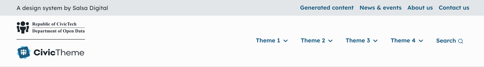

# Header

The header section appears at the top of your website. It comprises:

1. Site slogan
2. Logos
3. Secondary navigation
4. Primary navigation

### Configuring the Header

The Theme is applied to all four above mentioned sections of the header.

To apply the `Light` or `Dark` theme to the Header go to `/admin/appearance/settings/<site-name>` and use the radio buttons.

<figure><figcaption></figcaption></figure>

### Header examples

The examples below illustrate the `Light` and `Dark` theme applied to the header. They also display:

1. Site slogan
2. Different Header logo configuration. Read more about [Header logo](logo.md) configuration.

#### Light theme Default desktop

<figure><figcaption>
Light theme desktop Header with Logo set to Default
</figcaption></figure>

#### Light theme Default mobile

<figure><figcaption>
Light theme mobile Header with Logo set to Default
</figcaption></figure>

#### Light theme Stacked desktop

<figure><figcaption>
Light theme desktop Header with Logo set to Stacked
</figcaption></figure>

#### Light theme Stacked mobile

<figure><figcaption>
Light theme mobile Header with Logo set to Stacked
</figcaption></figure>

#### Dark theme Inline desktop

<figure><figcaption>
Dark theme desktop Header with Logo set to Inline
</figcaption></figure>

#### Dark theme Inline mobile

<figure><figcaption>
Dark theme mobile Header with Logo set to Inline
</figcaption></figure>

#### Dark theme Inline stacked desktop

<figure><figcaption>
Dark theme desktop Header with Logo set to Inline stacked
</figcaption></figure>

#### Dark theme Inline stacked mobile

<figure><figcaption>
Dark theme mobile Header with Logo set to Inline stacked
</figcaption></figure>

