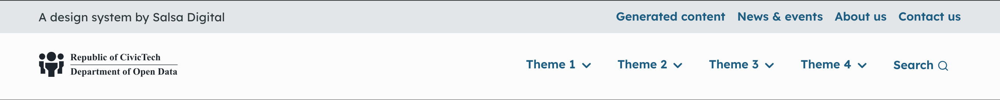
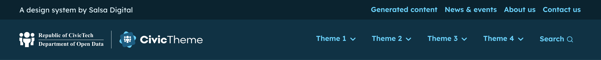
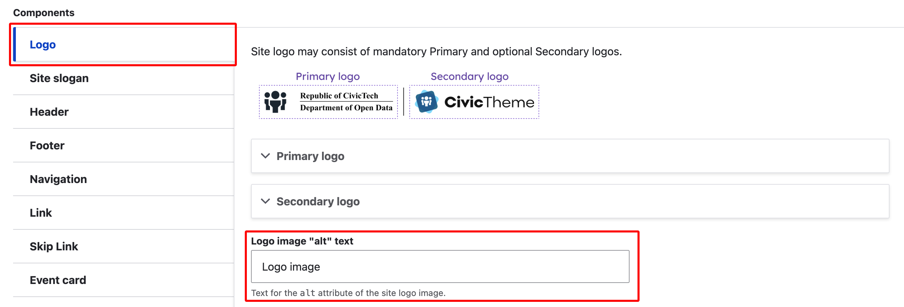
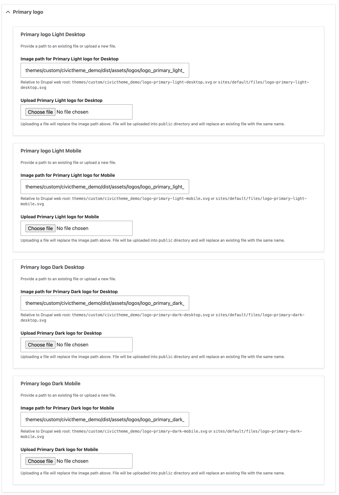
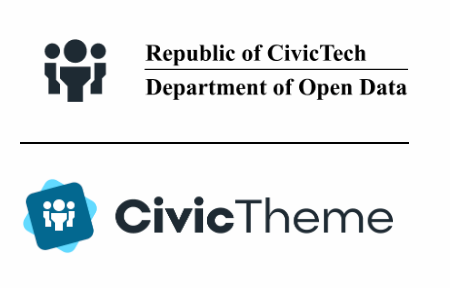
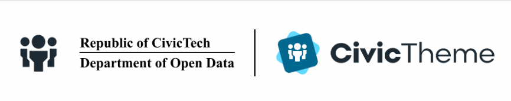

# Header logos

CivicTheme allows several Header logo configurations.&#x20;

You can add up two logos, a Primary and a Secondary logo. The Secondary logo is useful in the case of dual branding, e.g. your Department logo and the Commonwealth Coat of Arms.

Once you have uploaded your logo you can then select how you want the logo/s to display in the Header.

When you set the Header Theme, `Light` or `Dark`, you need to consider the logos you've uploaded. If you use the `Light` theme, your logo needs to be dark enough to be visually _accessible_ on the light background. If you use the `Dark` theme, you need to ensure you're logo is light enough that it will be visually accessible on a dark background.&#x20;

<figure><figcaption>
'Default' Logo desktop (<code>Light</code> theme)
</figcaption></figure>

<figure><figcaption>
'Inline' Logo desktop (<code>Dark</code> theme)
</figcaption></figure>

### Adding / updating logos 

The process is the same for the Primary and the Secondary logo.

1. Go to `/admin/appearance/settings/<site-name>`.
2. Scroll down to Components.
3. Select Logo.
4. Fill in the alt text for the logo first (so you don't forget later).

<figure><figcaption></figcaption></figure>

4. Open the Primary logo dropdown and take note of which logos need to be added for which use: `Light` and `Dark` theme, desktop and mobile use.
5. Select `Choose file` and follow the steps to add the logo. Do this for every logo type for the Primary logo.

<figure><figcaption></figcaption></figure>

5. If you're using a Secondary logo, open the Secondary logo dropdown and follow the same steps.&#x20;
6. Scroll to the bottom and select 'Save configuration'.

### Configure the Header logos 

#### Logo type 

Depending on the space within your site's 'Header', you can select how the Logo/s display.&#x20;

The following table illustrates the different Logo styles using example logos:

* Default
* Stacked (requires two logos)
* Inline
* Inline stacked (requires two logos)

<table data-header-hidden><thead><tr><th width="228.33333333333331"></th><th></th><th></th></tr></thead><tbody><tr><td><strong>Logo type</strong></td><td><strong>Desktop output</strong></td><td><strong>Mobile output</strong></td></tr><tr><td><strong>Default</strong> Uses the Primary logo only</td><td></td><td></td></tr><tr><td><strong>Stacked</strong> Uses both the Primary &#x26; Secondary logos</td><td></td><td></td></tr><tr><td><strong>Inline</strong> Desktop uses both Primary &#x26; Secondary. Mobile uses Primary only.</td><td></td><td></td></tr><tr><td><strong>Inline stacked</strong> Desktop (inline) &#x26; mobile (stacked) both use both Primary &#x26; Secondary logos.</td><td></td><td></td></tr></tbody></table>
