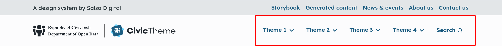
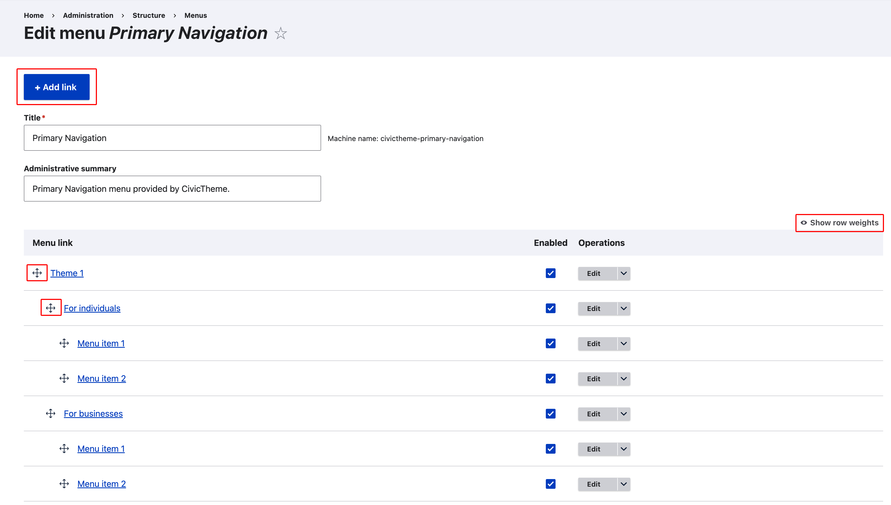
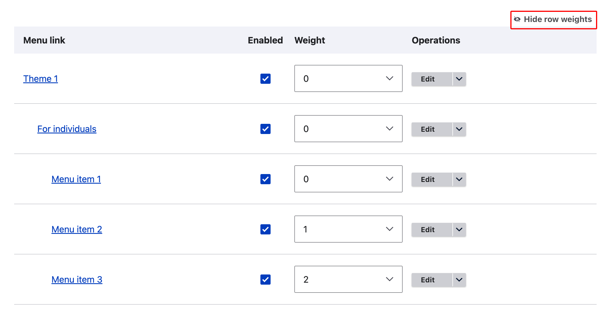
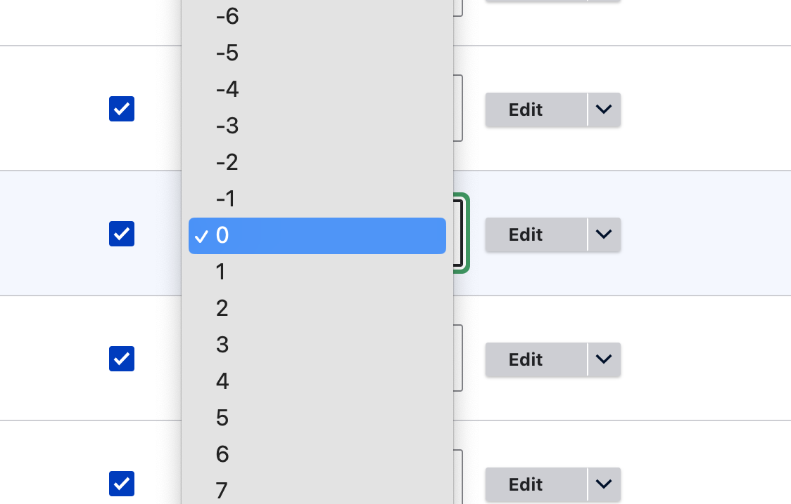

# Primary navigation

The Primary navigation is the main navigation for your website. It appears at the top of the page on the desktop (below the Secondary navgation).&#x20;

<figure><figcaption></figcaption></figure>

### Configuring the Primary navigation

How your roles and permissions have been configured will determine who can access and configure the menus. If your roles and permissions are _out of the box_, then only the Site Administrator (and Administrator) can edit the menus.&#x20;

The instructions below presume the tech team have already created a Primary navigation, even if there are no menu items in it.&#x20;

1. Go to Structure > Menus > Primary navigation `/admin/structure/menu`
2. Find the `Primary navigation` and `select Edit menu`
3. If there are no menu links present, select the `+ Add link` button to add your first Menu link.
4. Continue to add menu links
   1. Each new link will be added to the top of the menu and have a default weight of 0.
   2. From there you need to place the link in the correct order.

### Ordering menu links

It's recommended to order the menu links as you create them, especially if you have a large menu.

There are two ways to order your menu links:

1. Use the handles to drag the links around to reorder
2. Using row weights to set the weight.

#### Use handles&#x20;

Simply grab the handle and drag to the required position. Nest child menu links below the appropriate parent link.&#x20;

<figure><figcaption>
Add menu links, use handles to reorder menu links or click Show row weights
</figcaption></figure>

#### Use row weights

Click `Show row weights` to change from handles to weights. Open the dropdown to show the weight.&#x20;

* The lower the weight (e.g. `-10)` the higher the link will appear in the menu
* The higher the weight (e.g. `10)` the lower the link will display in the menu.&#x20;

Weights are also applied to child menu links.

<figure><figcaption>
Use row weights to reorder menu links
</figcaption></figure> <figure><figcaption>
Select the weight in the dropdown
</figcaption></figure>

### Enable menu links

To show a menu link item in the navigation the `Enabled` checkbox must be filled.&#x20;

If you want to hide the link from the menu, uncheck the box. If you hide a menu link, any child menu links will also be hidden from the menu.
