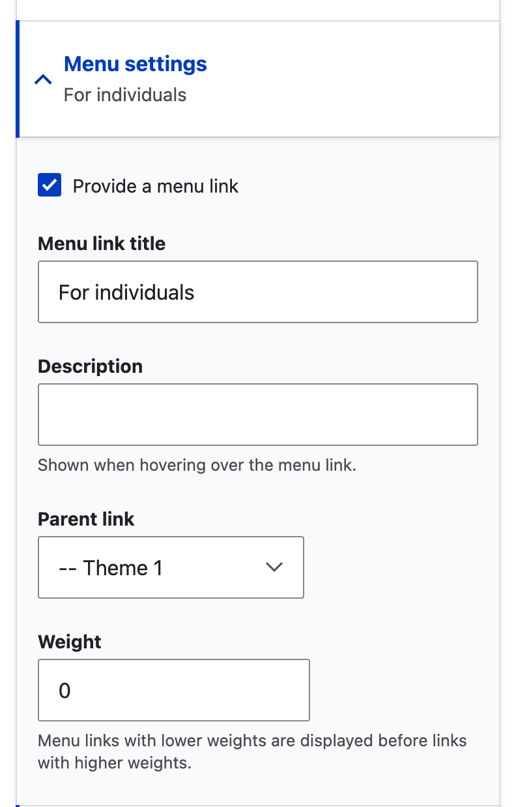
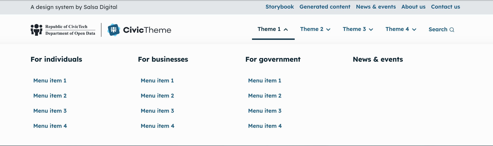
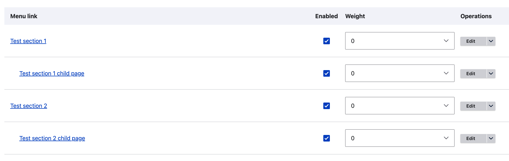

# Primary navigation

The Primary navigation is the main navigation for your website. It appears at the top of the page on the desktop below the Secondary navigation.

<figure><figcaption></figcaption></figure>

### Creating menu links

How your roles and permissions have been configured will determine who can access and configure the menus. If your roles and permissions are _out of the box_, then only the Site Administrator (and Administrator) can edit the menus.

The instructions below presume the tech team have already created a Primary navigation, even if there are no menu items in it.

1. Go to Structure > Menus > Primary navigation `/admin/structure/menu`
2. Find the `Primary navigation` and `select Edit menu`
3. If there are no menu links present, select the `+ Add link` button to add your first Menu link.
4. Continue to add menu links
   1. Each new link will be added to the top of the menu and have a default weight of 0.
   2. From there you need to place the link in the correct order.

### Ordering menu links

It's recommended to order the menu links as you create them, especially if you have a large menu.

There are two ways to order your menu links:

1. Use the handles to drag the links around to reorder
2. Using row weights to set the weight.

#### Use handles

Simply grab the handle and drag to the required position. Nest child menu links below the appropriate parent link.

<figure><figcaption>
Add menu links, use handles to reorder menu links or click Show row weights
</figcaption></figure>

#### Use row weights

Click `Show row weights` to change from handles to weights. Open the dropdown to show the weight.

* The lower the weight (e.g. `-10)` the higher the link will appear in the menu
* The higher the weight (e.g. `10)` the lower the link will display in the menu.

Weights are also applied to child menu links.

<figure><figcaption>
Use row weights to reorder menu links
</figcaption></figure> <figure><figcaption>
Select the weight in the dropdown
</figcaption></figure>

### Enabling menu links

To show a menu link item in the navigation the `Enabled` checkbox must be filled.

If you want to hide the link from the menu, uncheck the box. If you hide a menu link, any child menu links will also be hidden from the menu.

### Editing menu settings from the node (page) itself

You can also access menu settings for an individual page from the page itself.

1. Go to the page in question, and enter edit mode
2. On the right side of the edit interface click to open `Menu settings`
3. Add a Menu link. This is the link that will display in the navigation. If possible, it should match the page title. If the page title is very long you may consider shortening the Menu link.
4. Add a description if desired. The description displays when a user hovers over the Menu link.
5. Select the Parent link by opening the dropdown. If the menu is very large it can be challenging to find the right parent, and it might be easier to do this part in the Primary navigation settings as above.
6. Assign a weight. Again, if the menu is large it might be easier to go to the Primary navigation settings and use the handles to drag it to the right position or view the row weights for the entire menu to know which weight to assign.

<figure><figcaption></figcaption></figure>

### Configuring the navigation style

CivicTheme has three menu styles:

* [None](navigation.md#none)
* [Dropdown](navigation.md#dropdown-navigation-style)
* [Drawer](navigation.md#drawer-navigation-style)

To configure the navigation style:

1. Log in as a Site Administrator
2. In the admin menu, go to Appearance > Settings > \[Site name]
3. Scroll down and click to open `Navigation`
4. In the `Dropdown type` (for Primary or Secondary navigation) select the desired style (note the extra step for Drawer and Dropdown below)
5. Save the configuration

#### None

Screenshot to come

#### Drawer navigation style

<figure><figcaption>
Drawer style menu displaying child menu links. Note: news &#x26; events has no child menu links.
</figcaption></figure>

#### Dropdown navigation style

Screenshot to come

#### Extra steps for Drawer and Dropdown styles

To make the Drawer or Dropdown style display, you must do two things:

1. Ensure that every menu link is individually `Enabled`. The quickest way to do this is to go to go to Admin > Structure > Menus. Find the relevant menu, select `Edit` and ensure the `Enabled` checkbox is filled for each menu item.

<figure><figcaption>
Ensure every menu link is enabled if you want them to display in the Drawer or Dropdown menu
</figcaption></figure>

1. Go to Structure > Block layout. Find the relevant menu (Primary or Secondary), select `Configure` and check `Expand all menus`.

<figure><figcaption>
Ensure Expand all menu links is checked in the block
</figcaption></figure>

