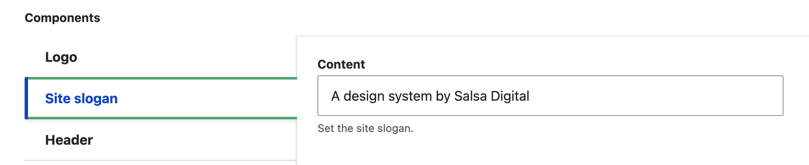

# Site slogan

The "Site slogan" displays in the header. It's an optional feature.

<figure><figcaption>
Fig. 1 - Site slogan front end
</figcaption></figure>

### Add / update the Site slogan

1. Go to `/admin/appearance/settings/<site-name>`.
2. Scroll down to the 'Components' section and select "Site slogan".
3. Enter your slogan in the 'Content' field.
4. Scroll down and select 'Save configuration'.

<figure><figcaption></figcaption></figure>
