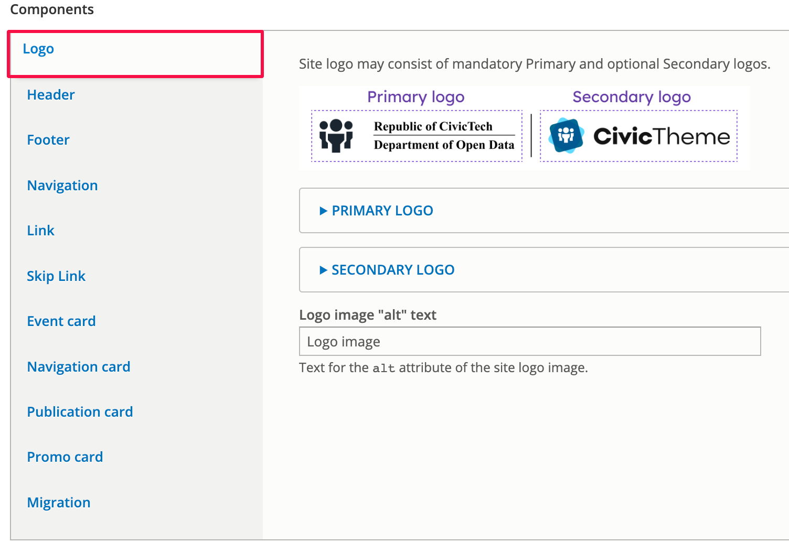
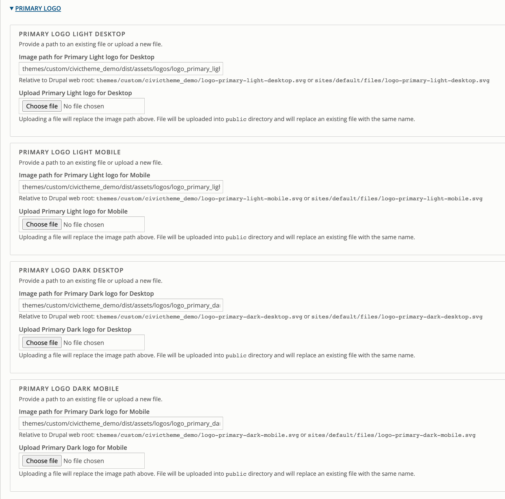
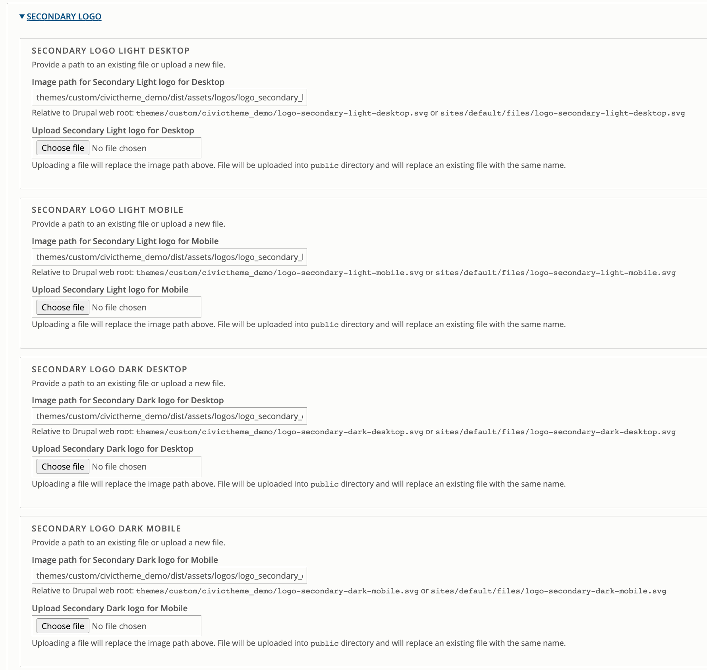
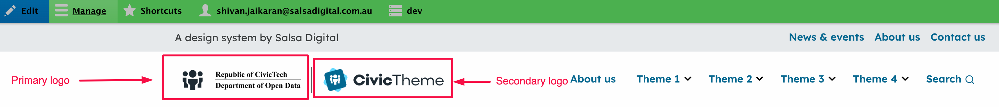

# Logo

### Summary 

This article will guide you through updating the logos on your CivicTheme site.

There are 2 groups of logos.

The first group is the primary logo and the second group is the secondary logo. You can choose to use one or both depending on your needs.

Inside of each group, there are options to upload logos for mobile and desktop. CivicTheme will automatically display the appropriate logo depending on the visitor’s viewport. That means, if you upload a mobile AND a desktop version of the same logo, only one will be displayed depending on your viewport size.

### Step 1 - Go to the theme configuration page 

Please see the [documentation on how to access the CivicTheme configuration page](https://salsadigital.atlassian.net/wiki/spaces/CIVIC/pages/2640249019/CivicTheme+Configuration+wip#Accessing-the-CivicTheme-configuration-page).

### Step 2 - Access the Logo tab 

Find the Components section and click on the “Logo” tab.

### Step 3 - Updating the Primary logo 

Expand the “Primary Logo” tab.

Here you can update primary logos for:

* Light desktop
* Light mobile
* Dark desktop
* Dark mobile

CivicTheme will automatically show the appropriate logo (desktop or mobile) based on the visitor’s viewport size.

### Step 4 - Updating the Secondary Logo 

Expand the “Secondary logo” tab.

Here you can update secondary logos for:

* Light desktop
* Light mobile
* Dark desktop
* Dark mobile

CivicTheme will automatically show the appropriate logo (desktop or mobile) based on the visitor’s viewport size.

### Final Result 

The logos are placed above the header section across all pages as shown in Figure 4.

