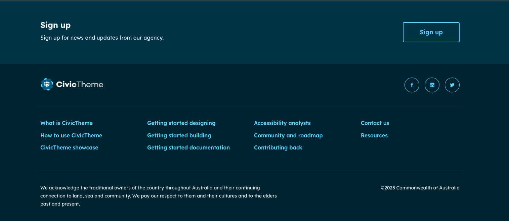

# Signup

The Signup component allows you to place a site-wide or per-page sign up block on your site.&#x20;

This is a Block type of Component. Signup is preconfigured out of the box, you can choose to use it as is or customise the content.

<figure><figcaption>
Example of OOTB Signup using Dark theme 
</figcaption></figure>

<figure><figcaption>
Example of OOTB Signup using Light theme 
</figcaption></figure>

### Add a Signup component

1. Go to Content > Blocks > Custom block library or `/admin/content/block`.
2. Select "Add content block" then "Component".
3. Fill in the "Block description". This is used only to reference the block, it doesn't display on the front end.
4. Open the "Components" dropdown and select "Promo".
5. Fill in the "Title" and "Content". These both display on the front end.
6. Add the "Link URL" and "Link text".&#x20;

<figure><figcaption></figcaption></figure>

### Edit Signup component

1. Go to Content > Blocks > Custom block library or `/admin/content/block`.
2. Find the relevant "Component" block type. You can filter by'Block description" and/or "Block type".
3. Select "Edit", make the required changes, and "Save".

### Styling

<figure><figcaption></figcaption></figure>

#### Theme

Every component in CivicTheme, such as the "Signup" component, can be shown as a `Light` or `Dark` theme component variant. This allows you to build more engaging landing pages with a mix of light and dark theme components.&#x20;

Use "Theme" radio button selector to change between themes.

#### Vertical spacing

Vertical spacing adds space before, after or both before and after a component. It is used to visually separate a component from other components when they are vertically stacked on the page. Use "Vertical spacing" dropdown to chose the appropriate values.&#x20;

You may need to adjust the vertical spacing on adjacent components to create visual balance.

### Configuring

Because the Signup is a Block, you can configure it to display globally. For example, if you want to display the Signup just above the footer on every page, you can configure to display in the `Content bottom` region.

You must be logged in with the "Site Administrator" role to do this.

1. Go to Structure > Block layout or `/admin/structure/block`
2. Scroll down to Content bottom
3. Select "Place block"

<figure><figcaption></figcaption></figure>

4. A pop up will open, enter the name of your block.
5. Select "Place block".

<figure><figcaption></figcaption></figure>

6. A pop up will open. In here you can configure the block to stop it displaying on certain pages.

<figure><figcaption></figcaption></figure>

#### Example of Signup with 'Content bottom' placement

<figure><figcaption></figcaption></figure>
