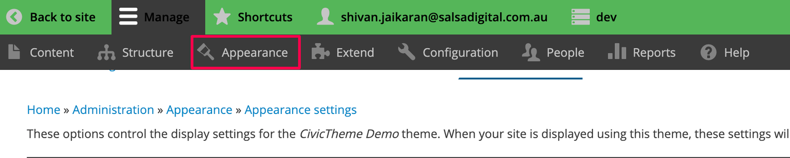
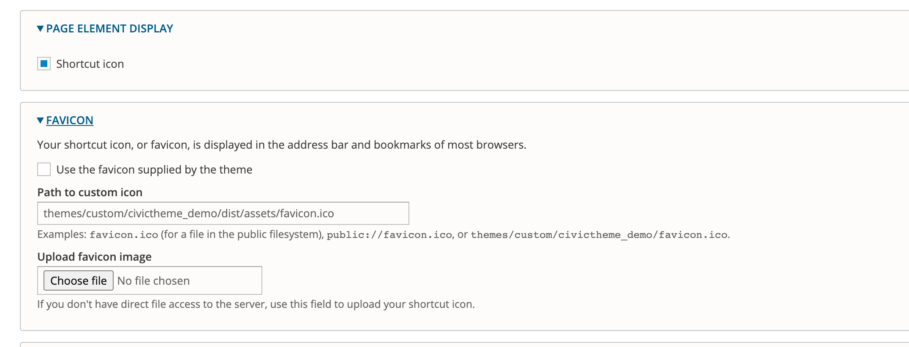

# Theme settings

### Summary 

Most of the theme settings are applied globally across your site.

This article shows you the different theme configurations available for CivicTheme.

### Accessing the CivicTheme configuration page 

**Note**: You must be logged in as a user with a "Site administrator" role to access this page.

1. Click on Appearance as shown below.

<figure><figcaption></figcaption></figure>

2. Click on “Settings” next to your installed CivicTheme.

<figure><figcaption></figcaption></figure>

### Overview of the CivicTheme configuration page 

<figure><figcaption></figcaption></figure>

### Page element display and Favicon 

<figure><figcaption></figcaption></figure>

Once the checkbox “Shortcut icon” is checked, then the Favicon options become available. You can upload your custom Favicon here.

### Colors 

See [Colors](colors.md) sub-section.

### Components 

The Components sections are split into multiple sections. Click the links below to read further documentation on these sections.

* [Logo](logo.md)
* [Header](header.md)
* [Footer](footer.md)
* [Navigation](navigation.md)
* [Link](link.md)
* [Skip link](skip-link.md)
* [Event card, Navigation card, Publication card, Promo card](cards.md)

### Storybook 

Storybook demonstrates components used in your site as a standalone library.

The components in the Storybook are a visual representation and they are not connected to the Drupal components.

Each component has properties that allow you to change the component and see how it visually changes.

While being primarily a development tool, the Storybook allows everyone to see all components at-a-glance without creating any special content for it.
