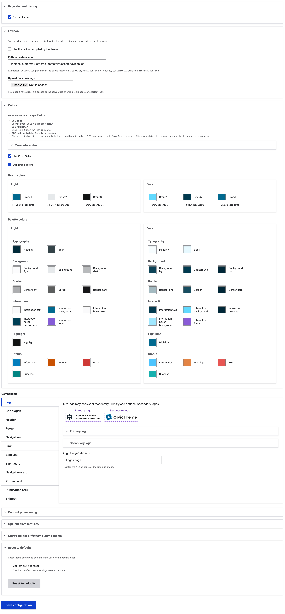

# Theme settings

Site-wide settings such as colours, logos, header and footer themes, character count on cards, and more, can be configured in the 'Settings' section.

### Accessing the CivicTheme settings page 

**Note**: You must be logged in as a user with a "Site administrator" role to access this page.

1. Go to `/admin/appearance/settings/<theme-name>`
2. Click on 'Settings' next to your installed CivicTheme site.

<figure><figcaption></figcaption></figure>

### Overview of the CivicTheme Settings page 

<figure><figcaption></figcaption></figure>

### Page element display 

This section allows to upload a favicon to your site. See [Favicon](favicon.md).

### Colours 

Use your brand colours to set the colour theme for your site. See [Colours](colours.md).

### Components 

The sections within 'Components' allow you to set site wide items such as the site slogan, logo/s, how links behave, character count on cards.

Learn more using the links below:

* [Logo](logo.md)
* [Site Slogan](site-slogan.md)
* [Header](header.md)
* [Footer](footer.md)
* [Navigation](navigation.md)
* [Link](link.md)
* [Skip link](skip-link.md)
* [Event card, Navigation card, Publication card, Promo card](broken-reference)

### Storybook 

Storybook demonstrates components used in your site as a standalone library.

The components in the Storybook are a visual representation and they are not connected to the Drupal components.

Each component has properties that allow you to change the component and see how it visually changes.

While being primarily a development tool, the Storybook allows everyone to see all components at-a-glance without creating any special content for it.
