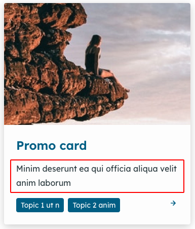

# Cards

There are four cards available:

* Event card
* Navigation card
* Publication card
* Promo card

Each of these cards has an option to display a summary (Fig. 1).&#x20;

If you choose to add a summary to your cards, follow these steps to individually configure the character count for each card type. This will set the character count for each card type site-wide.

<figure><figcaption>
Fig. 1 - Promo card with summary
</figcaption></figure>

### Change the card summary length

1. Go to `/admin/appearance/settings/<site-name>`.
2. Scroll down to the 'Components' section and select the card type you want to configure.
3. Enter the 'Summary length'.
4. Scroll down and select 'Save configuration'.

<figure><figcaption>
Fig. 2 - Event card summary back end
</figcaption></figure>
