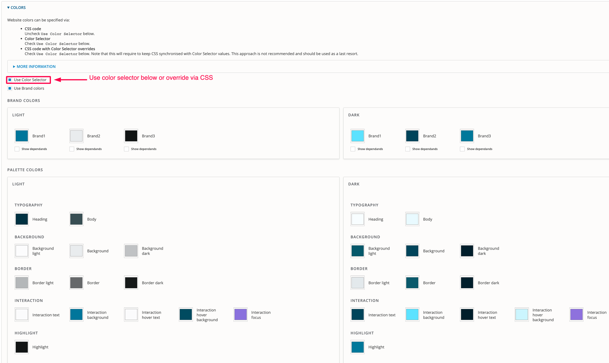
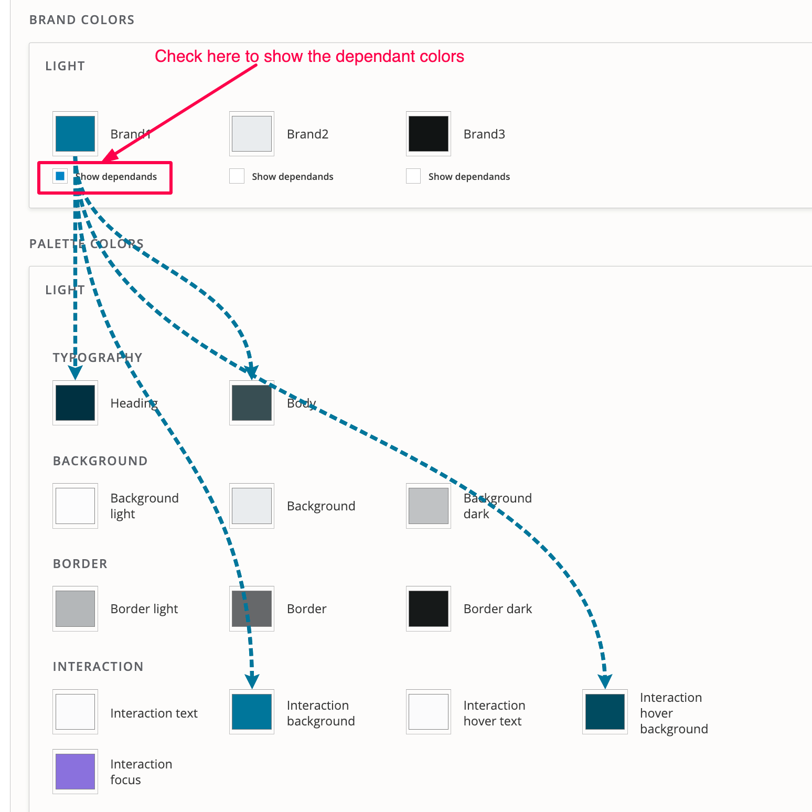

# Colors

CivicTheme allows you to change the color of all elements from the configuration page without additional development.

To enable this functionality, check "Use Color Selector". If not selected, the default CSS will be used.

<figure><figcaption></figcaption></figure>

There are 2 visual themes available: `Light` and `Dark`. These are the visual themes consisting of Palette Colors that every component can be shown as.

Palette Colors are named after the purpose of the color: `Heading` defines the color of all headings, while `Background` defines the background color.

Some colors are represented in different variants: `Border light`, `Border`, `Border dark`. This is to allow more visual variety on component colors.

Every component has a mapping to a set of designated colors based on the element the component uses.

#### **Brand colors**

The Brand colors use predefined formulas that automatically update the Palette colors. In other words, if you change the brand colors then the corresponding dependents will automatically update.&#x20;

This is used as a short-hand to set 14 Palette colors using only 3 Brand colors. It also allows us to quickly produce Palette colors if only Brand colors are provided.

Brand colors is only a "helper" tool. Every Palette color value produced from the Brand color can be overridden.

To see which Brand colors drive which Palette color, check the "Show dependents" checkbox under the Brand color.

<figure><figcaption></figcaption></figure>

