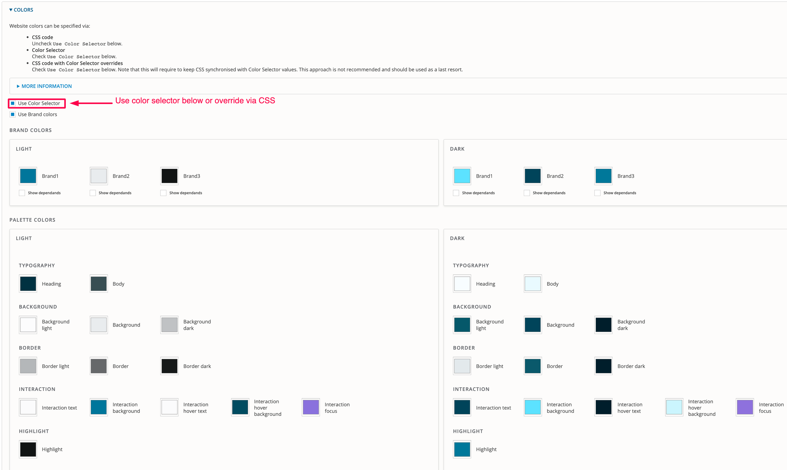
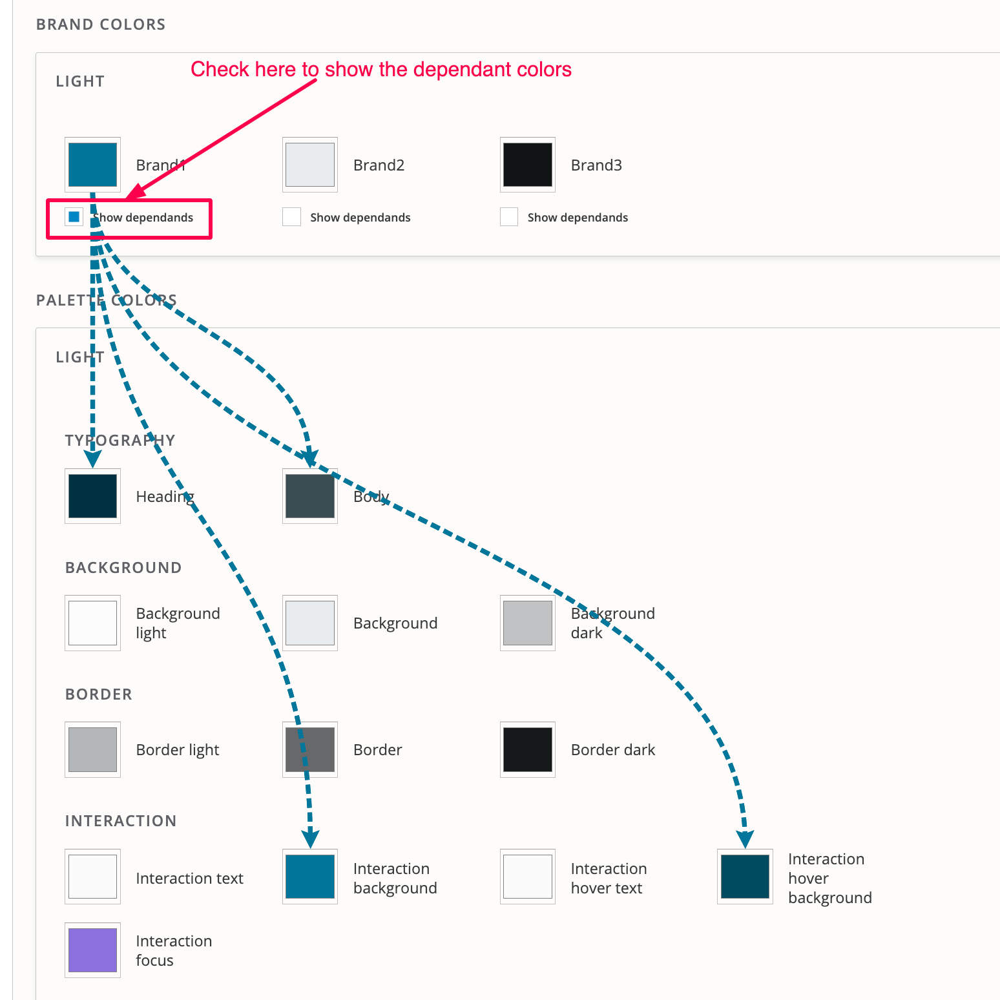

# Colours

CivicTheme allows you to change the colour of all elements from the configuration page without additional development.

To enable this functionality, check "Use Colour Selector". If not selected, the default CSS will be used.

<figure><figcaption></figcaption></figure>

There are 2 visual themes available: `Light` and `Dark`. These are the visual themes consisting of Palette Colours that every component can be shown as.

Palette Colours are named after the purpose of the colour: `Heading` defines the colour of all headings, while `Background` defines the background colour.

Some colours are represented in different variants: `Border light`, `Border`, `Border dark`. This is to allow more visual variety on component colours.

Every component has a mapping to a set of designated colours based on the element the component uses.

#### **Brand colours**

The Brand colours use predefined formulas that automatically update the Palette colours. In other words, if you change the brand colours then the corresponding dependents will automatically update.&#x20;

This is used as a short-hand to set 14 Palette colours using only 3 Brand colours. It also allows us to quickly produce Palette colours if only Brand colours are provided.

Brand colours is only a "helper" tool. Every Palette colour value produced from the Brand colour can be overridden.

To see which Brand colours drive which Palette colour, check the "Show dependents" checkbox under the Brand colour.

<figure><figcaption></figcaption></figure>

