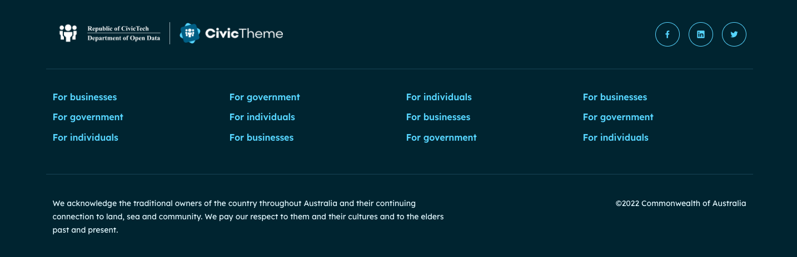

# Footer settings

### Access the footer settings 

1. Go to `/admin/appearance/settings/` find your site and select 'Settings'.
2. Scroll down the page until you see the 'Components' section, and select 'Footer'.

<figure><figcaption>
Fig. 1 - Footer theme settings
</figcaption></figure>

### Theme

Use the 'Theme' radio buttons to set the footer in 'Light' or 'Dark' theme.&#x20;

If you change the footer theme, you will also need to make the same theme change to the blocks you used to build the footer. In the example below we had to change the 'Acknowledgement' block. the 'Copyright' block and the 'Social media' block.

#### **Dark theme footer - desktop**

This footer demonstrates the 'Dark' theme, using the 'Inline stacked' footer. Logos are inline on desktop devices.

<figure><figcaption>
Fig. 2 - Dark theme footer with 'Inline stacked' logo
</figcaption></figure>

#### Light theme footer - mobile 

This footer demonstrates the 'Light' theme, using the 'Inline stacked' footer which stacks on mobile devices. **Note:** the Social media section is not part of the Logo section.

<figure><figcaption>
Fig. 2 - Light theme footer with 'Inline stacked' logo
</figcaption></figure>

### Logo type 

Depending on the space within your site's Footer, you can select how the Logo (with one or two images) is shown.

The following table outlines the Logo type using example logos:

| **Logo type**                                                                                                                    | **Final output (desktop)**                   | **Final output (mobile)**                    |
| -------------------------------------------------------------------------------------------------------------------------------- | -------------------------------------------- | -------------------------------------------- |
| 
<strong>Default</strong> Uses the Primary logo only
                                                                    |  |  |
| 
<strong>Stacked</strong> Uses both the Primary &#x26; Secondary logos
                                                  |  |  |
| 
<strong>Inline</strong> Desktop uses both Primary &#x26; Secondary. Mobile uses Primary only.
                       |  |  |
| 
<strong>Inline stacked</strong> Desktop (inline) &#x26; mobile (stacked) both use both Primary &#x26; Secondary logos.
 |  |  |

### Footer background image 

You can choose to display a background image on your footer. However, keep in mind that a detailed image could create issues with accessibility if the written content in the footer can't be read on top of the image.

To add an image:

* Paste in the relative link to the image if it's already in the media library, or,
* Upload a new image using the 'Choose file' button.

