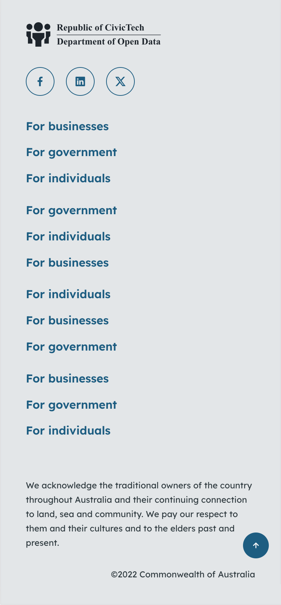
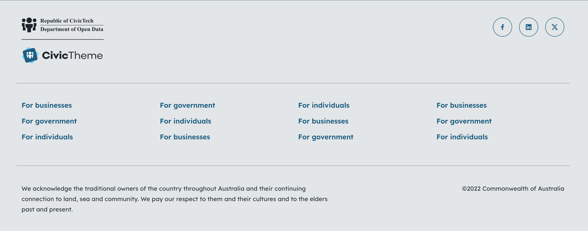
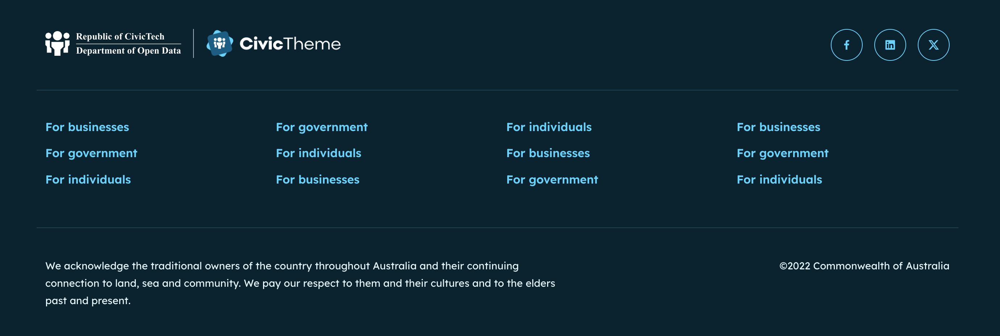
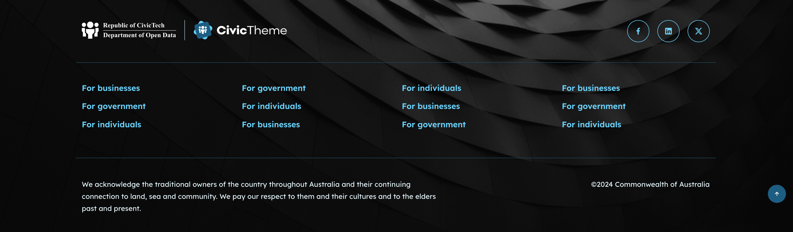

# Footer

### Access the footer settings 

1. Go to `/admin/appearance/settings/` find your site and select 'Settings'.
2. Scroll down the page until you see the 'Components' section, and select 'Footer'.

<figure><figcaption>
Footer theme settings
</figcaption></figure>

### Theme

Use the Theme radio buttons to set the footer in Light or Dark theme.&#x20;

If you change the footer theme, you will also need to make the same theme change to the blocks you used to build the footer. In the example below we had to change the Acknowledgement block. the Copyright block and the Social media block.

### Logo type 

Using the Logo type radio buttons in the Footer settings you can configure your logos to display one logo or both logos (if you ave two).&#x20;

The following table outlines the Logo type using example logos:

| **Logo type**                                                                                                                    | **Final output (desktop)**                   | **Final output (mobile)**                    |
| -------------------------------------------------------------------------------------------------------------------------------- | -------------------------------------------- | -------------------------------------------- |
| 
<strong>Default</strong> Uses the Primary logo only
                                                                    |  |  |
| 
<strong>Stacked</strong> Uses both the Primary &#x26; Secondary logos
                                                  |  |  |
| 
<strong>Inline</strong> Desktop uses both Primary &#x26; Secondary. Mobile uses Primary only.
                       |  |  |
| 
<strong>Inline stacked</strong> Desktop (inline) &#x26; mobile (stacked) both use both Primary &#x26; Secondary logos.
 |  |  |

### **Footer examples**

**Notes:**&#x20;

* The Social media icons, the Acknowledgement of Country and the Copyright sections are all Content blocks. The theme (Light or Dark) for these are set at the individual block level, meaning if you change the Footer theme from Dark to Light you will also need to update the themes on the Content blocks.
* The footer column headings are switched off in these examples, further screenshots to come to illustrate the footer column headings on display.

#### Light theme Default desktop

<figure><figcaption>
Light theme desktop Footer with Logo set to Default
</figcaption></figure>

#### Light theme Default mobile

<figure><figcaption>
Light theme mobile Footer with Logo set to Default
</figcaption></figure>

#### Light theme Stacked desktop

<figure><figcaption>
Light theme desktop Footer with Logo set to Stacked
</figcaption></figure>

#### Light theme Stacked mobile

<figure><figcaption>
Light theme desktop Footer with Logo set to Stacked
</figcaption></figure>

#### Dark theme Inline desktop

<figure><figcaption>
Dark theme desktop Footer with Logo set to Inline
</figcaption></figure>

#### Dark theme Inline mobile

<figure><figcaption>
Dark theme mobile Footer with Logo set to Inline
</figcaption></figure>

#### Dark theme Inline stacked desktop

<figure><figcaption>
Dark theme desktop Footer with Logo set to Inline stacked
</figcaption></figure>

#### Dark theme Inline stacked mobile

<figure><figcaption>
Dark theme mobile Footer with Logo set to Inline stacked
</figcaption></figure>

### Footer background image 

You can choose to display a background image on your footer. However, keep in mind that a detailed image could create issues with accessibility if the written content in the footer can't be read on top of the image.

To add an image:

* Paste in the relative link to the image if it's already in the media library, or,
* Upload a new image using the 'Choose file' button.

<figure><figcaption>
Dark theme footer with background image
</figcaption></figure>

