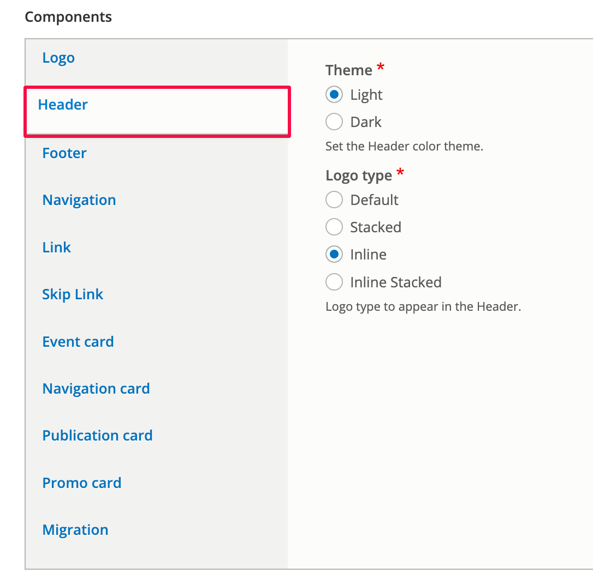

# Header

### Summary 

This article will guide you through updating the Header settings of your CivicTheme site.

### Step 1 - Go to the theme configuration page 

Please see the [documentation on how to access the CivicTheme configuration page](https://salsadigital.atlassian.net/wiki/spaces/CIVIC/pages/2640249019/CivicTheme+Configuration+wip#Accessing-the-CivicTheme-configuration-page).

### Step 2 - Access the Header tab 

Find the Components section and click on the “Header” tab.

You can set the theme color and logo type.

### Logo type 

The following table outlines the default Logo type settings as it pertains to a default CivicTheme site. It may vary on your site.

| **Logo type**  | **Final Output (Desktop)**                   | **Final Output (mobile)**                    |
| -------------- | -------------------------------------------- | -------------------------------------------- |
| Default        |  |  |
| Stacked        |  |  |
| Inline         |  |  |
| Inline Stacked |  |  |
