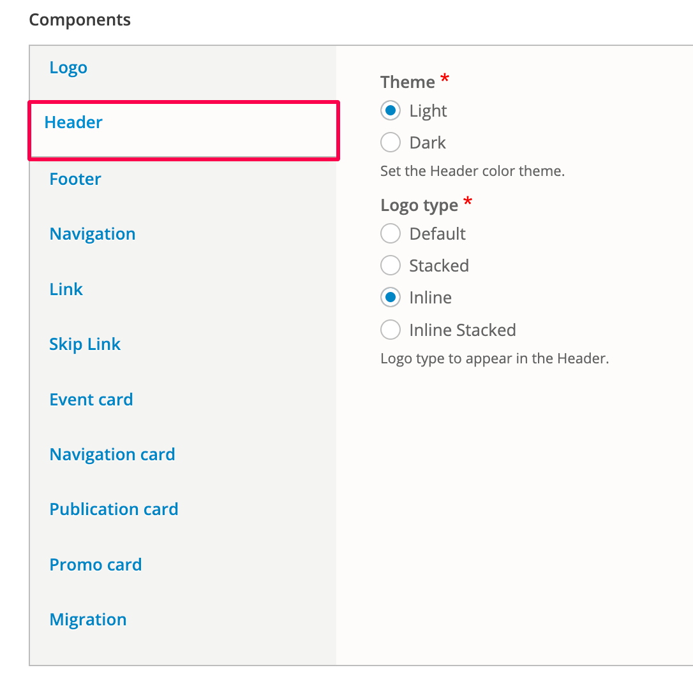

# Header

The The Header component consists of the Primary and Secondary menus, the Logo, and the Site slogan.&#x20;

These site-wide header theme settings allow you to set the 'Light' or 'Dark' theme (header background) and select the Logo style for the Header.

The Site slogan and menus are set up elsewhere. Learn how to set up the [Site slogan](site-slogan.md) and [update the menus](../header.md#updatingtheheader-2.updatingtheprimaryandsecondarylogos).

### Header theme

To apply the Light or Dark theme to the Header, and to select the Logo type, simply use the radio buttons.

<figure><figcaption>
Header theme settings
</figcaption></figure>

### Logo type 

Depending on the space within your site's Header, you can select how the Logo (using one or two images) is displayed.&#x20;

In order to use 'Stacked' or 'Inline stacked' logo styles you must add both a Primary and a Secondary logo to the site. Go to [Logos](logo.md) to learn about adding logos.&#x20;

The following table illustrates the different Logo styles using example logos:

| **Logo type**                                                                                                                    | **Desktop output**                           | **Mobile output**                            |
| -------------------------------------------------------------------------------------------------------------------------------- | -------------------------------------------- | -------------------------------------------- |
| 
<strong>Default</strong> Uses the Primary logo only
                                                                    |  |  |
| 
<strong>Stacked</strong> Uses both the Primary &#x26; Secondary logos
                                                  |  |  |
| 
<strong>Inline</strong> Desktop uses both Primary &#x26; Secondary. Mobile uses Primary only.
                       |  |  |
| 
<strong>Inline stacked</strong> Desktop (inline) &#x26; mobile (stacked) both use both Primary &#x26; Secondary logos.
 |  |  |

### Header examples

#### Light theme Default desktop

<figure><figcaption>
Light theme desktop Header with Logo set to Default
</figcaption></figure>

#### Light theme Default mobile

<figure><figcaption>
Light theme mobile Header with Logo set to Default
</figcaption></figure>

#### Light theme Stacked desktop

<figure><figcaption>
Light theme desktop Header with Logo set to Stacked
</figcaption></figure>

#### Light theme Stacked mobile

<figure><figcaption>
Light theme mobile Header with Logo set to Stacked
</figcaption></figure>

#### Dark theme Inline desktop

<figure><figcaption>
Dark theme desktop Header with Logo set to Inline
</figcaption></figure>

#### Dark theme Inline mobile

<figure><figcaption>
Dark theme mobile Header with Logo set to Inline
</figcaption></figure>

#### Dark theme Inline stacked desktop

<figure><figcaption>
Dark theme desktop Header with Logo set to Inline stacked
</figcaption></figure>

#### Dark theme Inline stacked mobile

<figure><figcaption>
Dark theme mobile Header with Logo set to Inline stacked
</figcaption></figure>

