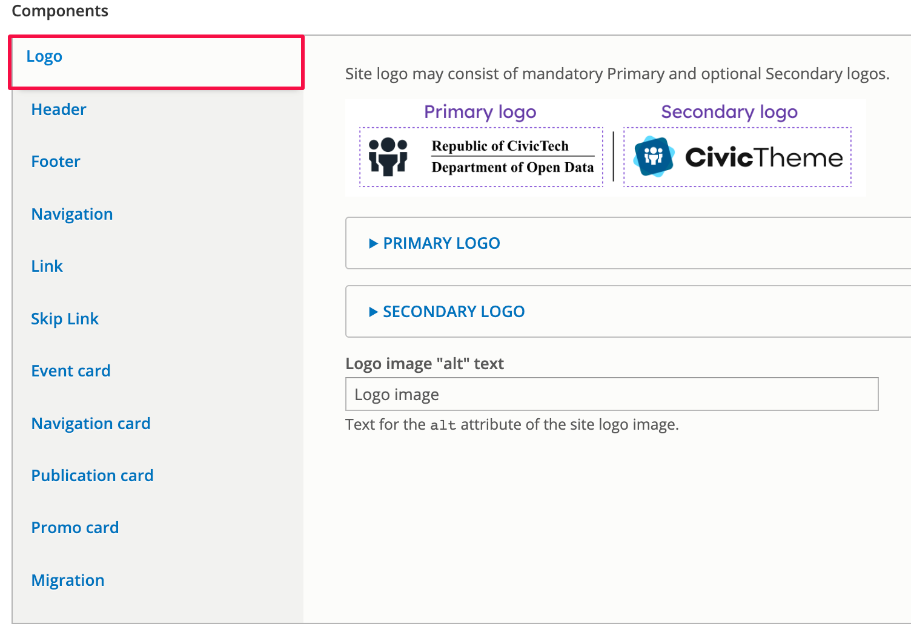
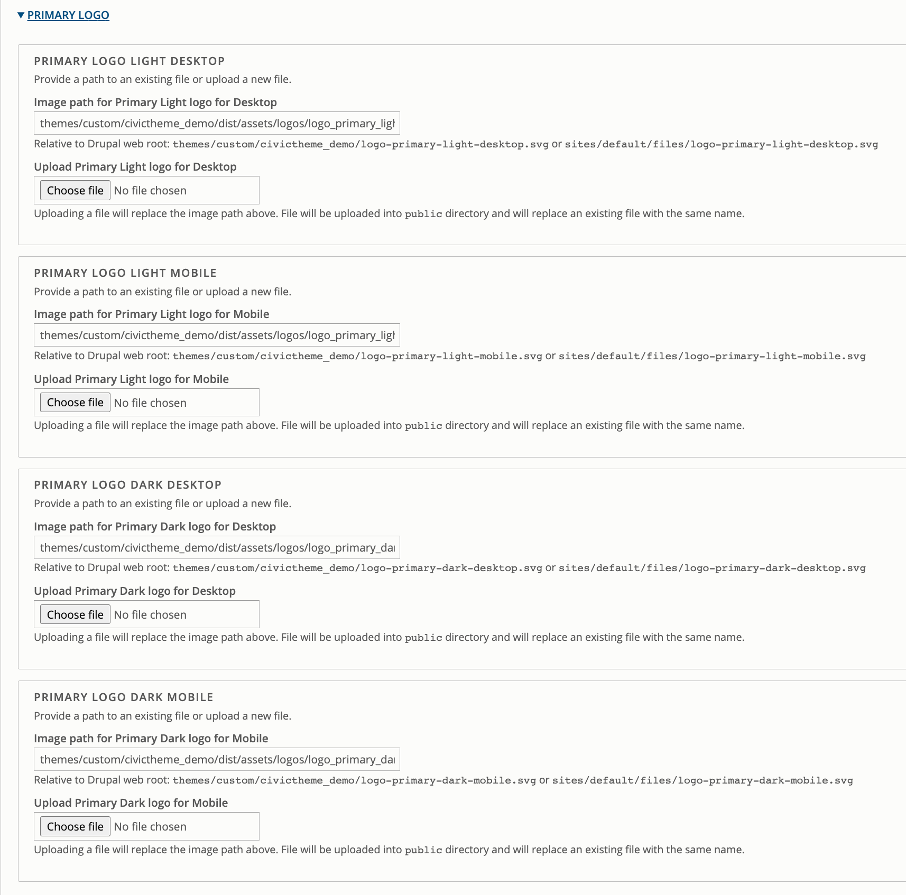

# Logo

The site logo/s display in the Header and the Footer of the site.

<figure><figcaption>
Fig. 1 -  Example of a Inline logo on a Dark themed header
</figcaption></figure>

<figure><figcaption>
Fig. 2 - Example of Inline logo on Light themed footer
</figcaption></figure>

### Logos for Light and Dark theme 

You must upload appropriate logos for use in the `Light` and/or `Dark` theme.&#x20;

If you use the `Dark` theme, you need to ensure you're logo is light enough that it will be visually accessible on a dark background  (see fig. 1). If you use the `Light` theme, your logo needs to be dark enough to be seen on the light background  (see fig. 2).&#x20;

### Primary vs Secondary logo 

You can add a Primary and a Secondary logo to your CivicTheme site. This is useful in the case of dual branding, e.g. your logo and the Commonwealth Coat of Arms (see Figs. 1 & 2).

Once you have uploaded your logo you can then select how you want the logo/s to display in the Header and the Footer. This can be done in the [Header settings](header-settings.md#header-logotype) and the [Footer settings](footer-settings.md#header-logotype-1).

### Adding / updating the Primary & Secondary logos 

The process is the same for the Primary and the Secondary logo.

We're using the Primary logo as the example here, follow the same steps for the Secondary logo.

<figure><figcaption>
Fig. 3 - Logo settings
</figcaption></figure>

1. Select 'Logo' in the list of Components.
2. Fill in the alt text for the logo.
3. Open the 'Primary logo' dropdown and carefully note which logos need to be added for which use - Light and Dark theme, and desktop and mobile use.
4. Do this for the 'Secondary logo' if you are using one.&#x20;
5. Scroll to the bottom and select 'Save configuration'.
6. Now go to [Header settings](header-settings.md#header-logotype) and the [Footer settings](footer-settings.md#header-logotype-1) to configure the way the logo displays in each of those places.

<figure><figcaption>
Fig. 4 - Primary logo fields
</figcaption></figure>
