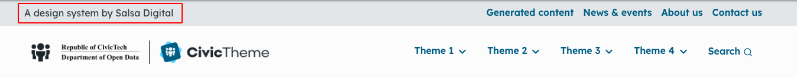
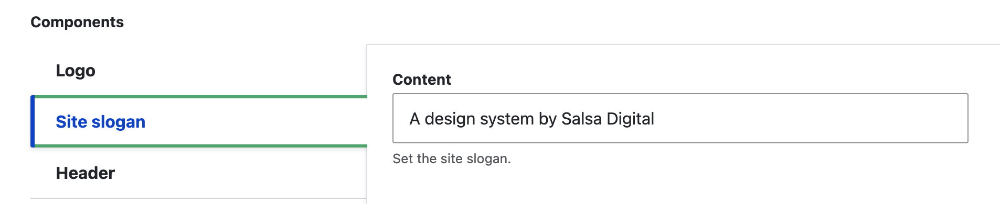

# Site slogan

<figure><figcaption>
Fig. 1 - Site slogan front end
</figcaption></figure>

Adding a site slogan is optional.

### Add / update the Site slogan

1. Go to `/admin/appearance/settings/<site-name>`.
2. Scroll down to the 'Components' section and select 'Site slogan'.
3. Add or update the 'Content' field.
4. Scroll down and select 'Save configuration'.

<figure><figcaption>
Fig. 1 - Site slogan field
</figcaption></figure>

