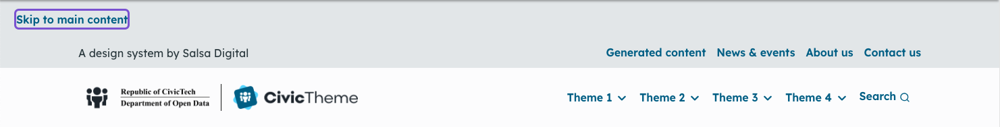
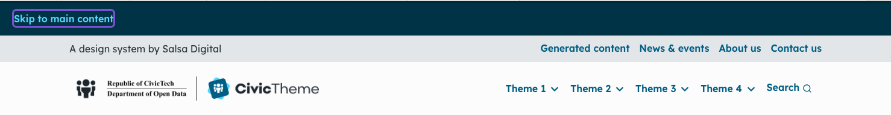

# Skip link

The 'Skip link' section is an accessibility feature that allows people using assistive technology to skip navigation links by using the 'Skip to main content' button.

### Light theme

This illustrates the Light theme skip link and a Light theme menu.

<figure><figcaption>
Fig. 1 - Light theme skip link
</figcaption></figure>

### Dark theme

This illustrates the Light theme skip link and a Dark theme menu.

<figure><figcaption>
Fig. 1 - Dark theme skip link
</figcaption></figure>

### Change the Skip link colour

1. Go to `/admin/appearance/settings/<site-name>`.
2. Scroll down to the 'Components' section and select 'Skip link'.
3. Select the Theme.
4. Scroll down and select 'Save configuration'.

<figure><figcaption></figcaption></figure>
