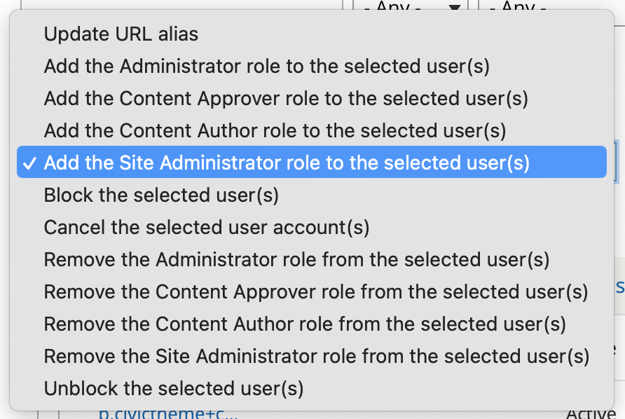

# User accounts &  roles

CivicTheme comes with 4 roles out-of-the-box. They are:

* Administrator - Administrators have access to ALL administration areas. This role should only be given to the lead technical role and senior developers in your team.&#x20;
* Site administrator - Site administrators have access to some of the administration areas.
* Content approver - Content approvers review and approve content so it can then be published on the website.
* Content author - Content authors are the main users responsible for creating and editing content.&#x20;

### Adding new users

1. Go to `/admin/people`.
2. Select `Add user`.
3. Fill out the relevant fields
   * Note on the password field: you need to add a password to create a new user account, the new user will be directed to reset their password when they first login.
   * Check the box to send the user an email notification. The link they receive will lead them to a password update form.
4. Save.

### Assigning & unassigning roles

1. Go to `/admin/people`.
2. Select the person you want to assign or unassign a role to/from.
3. Open the Actions dropdown.
4. Select 'Apply to selected items'.

<figure><figcaption></figcaption></figure>

