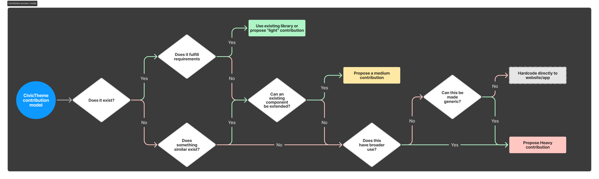

# Contribution model

Contributing to CivicTheme follows a clear process to ensure that all additions meet community and technical standards. This guide will help you understand the various levels of contributions—small, medium, and major—along with the associated requirements and steps for each.

## Overview of the contribution process

Before you start contributing to CivicTheme, review our contribution model. This model shows you how to consider your contributions so that they can be routed and managed properly.

CivicTheme welcomes contributions in various forms, from small enhancements to more complex components. The process is designed to assess whether an existing component fulfils the needs, or if a new contribution is necessary. Contributions are categorised into three levels:

* [Small Contribution ](contribution-model.md#light-contribution)
* [Medium Contribution ](contribution-model.md#medium-contribution)
* [Major Contribution ](contribution-model.md#heavy-contribution)

This document outlines each level of contribution and provides guidance on how to determine the most appropriate level for your proposed changes.

<figure><figcaption>
Contribution model diagram. Click on the image to zoom in.
</figcaption></figure>

***

## Small contribution

A small contribution typically involves minimal changes, such as small adjustments to existing components or minor bug fixes. This type of contribution is most often used when:

* A solution already exists in the component library.
* The existing component can be easily extended with minimal code changes.

### What we need from you:

* **Minimal documentation**: Provide a brief description of the change, what it fixes or improves, and any references to related issues. User guides will be updated, including compliance, security, or research sections.&#x20;
* **Testing**: Ensure your changes do not break existing functionality. Provide tests or manual testing instructions, and ensure you've thoroughly tested prior to submitting.
* **Code quality**: Maintain consistent code style with the existing CivicTheme codebase.

#### When to Propose a small contribution:

* If a component or solution already exists and only minor tweaks are needed.
* If the functionality of a component is extended without affecting its broader use.

#### Example small contributions:

* Fixing a CSS alignment issue on an existing button.
* Adding a small utility class to a component for accessibility.

#### How to submit:

* Follow the basic contribution guidelines and submit your pull request (PR) via [GitHub](https://github.com/civictheme).
* Reference related issues or discussions if applicable.


Link: [Small contribution spec template](contribution-model.md#light-contribution)


***

## Medium contribution

A medium contribution is necessary when your proposed changes require extending an existing component or creating a new feature that addresses a specific need but does not yet have a broader application.

### What we need from you:

* **Documentation**: Provide a detailed explanation of the contribution, including use cases, and reference designs or discussions.
* **Testing**: Provide thorough test cases to ensure the contribution works in all expected environments, ensuring you've tested your changes prior to submitting.
* **Broader Use**: Clarify if the new feature can evolve for wider usage across the CivicTheme system.

#### When to propose a medium contribution:

* If the existing component cannot be extended easily and requires more significant changes.
* If others can potentially reuse the new feature, but it is initially being built for a specific purpose.

#### Example medium contributions:

* Adding a new input field type to the form component with validation.
* Creating a new, reusable layout option for a specific website section.

#### How to submit:

* Provide more detailed documentation in the PR, explaining the purpose and broader application possibilities.
* Ensure full test coverage and reference any designs or issues.
* Submit via [GitHub](https://github.com/civictheme) with a link to the related issue or proposal.


Link: [Medium contribution spec template](medium-contribution-spec.md)


***

## Major contribution (RFC process)

Major contributions involve significant changes to CivicTheme, such as new components, removing existing features, or altering fundamental design principles. These changes require broader community discussion and approval through the [**RFC process**](#user-content-fn-1)[^1].

**When to use the RFC process for major contributions:**

* Introducing new components or patterns.
* Adding new API surface areas or modifying major existing APIs.
* Removing features already released.
* Creating new conventions or design principles.

### What we need from you:

* **Comprehensive documentation**: A detailed breakdown of the problem, proposed solution, and how the contribution fits into the broader CivicTheme structure. Include mockups, wireframes, or other design assets if applicable.
* **Broader use**: Ensure the new component is designed with reuse in mind, following design principles that support various use cases across the system.
* **Extensive testing**: Rigorous testing in various environments and edge cases is required to ensure the component is robust and can be maintained. Please provide test cases that reviewers can test as well.

#### When to propose a major contribution:

* If there is no existing component or solution that can be easily extended or adapted.
* If the new component is expected to be used broadly across different applications or sites.

#### Example major contributions:

* Creating an entirely new navigation component for CivicTheme.
* Proposing a large design system change that requires updates to multiple components.

#### How to submit:

* Open a discussion in the CivicTheme community forums, Drupal.org, or GitHub discussions to gather feedback before coding begins.
* Submit a detailed proposal and follow the community approval process.
* Once approved, develop the contribution, ensuring thorough documentation and testing before submitting a PR on [GitHub](https://github.com/civictheme).


Link: [Major contribution spec template](major-rfc-level-contribution-spec.md)


***

## Hardcoding vs contributing

In some cases, a solution may only be applicable to a single website or application. In such instances, hardcoding the solution directly may be more efficient than contributing a reusable component. However, whenever possible, contributions should aim for reusability within the broader CivicTheme ecosystem.

#### When to hardcode:

* When a solution is too specific to be reused across other projects or cannot be made generic.

#### Example:&#x20;

* Adding a one-off feature or custom styling for a single website section that does not fit CivicTheme's broader design principles.

***

By following this guide, you can ensure your contributions to CivicTheme are aligned with the project's goals and community standards. Contributions, whether small or large, help improve the system and provide value to all CivicTheme users.&#x20;

Ensure you follow the appropriate process based on the type of contribution you're making and provide all necessary documentation and testing before submitting your work.

***

## Contribution FAQs

What happens if I find an issue?

We're always interested in fixing issues, therefore issue reports are very welcome. Please make sure to check that your issue does not already exist in the relevant issue queue, be it for design, UI Kit, or Drupal.

What do I do with a feature request or idea I have?

First, review the [contribution model diagram](contribution-model.md#overview-of-the-contribution-process) at the top of this page. Establish which type of contribution your concept is closest to, and create an [issue](https://github.com/civictheme/monorepo-drupal/issues) with the associated level of documentation needed and we will review it.&#x20;

We can't guarantee that it will be implemented. But we are always interested in hearing ideas of what we could bring to CivicTheme.

Another good way is also to talk to us via [#civictheme-designsystem](https://drupal.slack.com/archives/C039UV0CQBZ) Slack about your idea. [Join today](https://drupal.slack.com/archives/C039UV0CQBZ)!

I've got code to contribute, what should I do?

Refer to the [contribution model diagram](contribution-model.md#overview-of-the-contribution-process) above to classify what sort of contribution you have in order to understand what process to follow.

What kinds of contributions can I make?

You can contribute in a variety of ways, including:

* Reporting bugs or issues with existing components.
* Suggesting improvements to existing components.
* Submitting new components or templates.
* Proposing changes to documentation.
* Participating in design or development discussions.
* Testing existing or new components and providing feedback.

How do I know what sort of contribution I have to make?

Review the diagram at the top of the [page](contribution-model.md#overview-of-the-contribution-process), or read below for a summary.

* **Small contributions** involve small changes, like bug fixes, minor design tweaks, or improvements to an existing component.
* **Medium contributions** extend existing components or create new features with moderate complexity and potential for reuse.
* **Major contributions** involve major changes, such as creating new, reusable components, altering the design system, or introducing new design principles. These contributions often have broader implications and may require more review and discussion through the RFC process.

How do I start contributing if I've never contributed to an open-source project before?

Start by checking the CivicTheme documentation and the contribution guide [here](broken-reference).&#x20;

Look for "good first issue" or "beginner-friendly" tags in the [GitHub repository](https://github.com/civictheme). These tags mark tasks that are great for new contributors. You can also start by reviewing and testing other people's contributions to get familiar with the project.&#x20;

Be sure to chat with the friendly team and community in our [Slack channel](https://drupal.slack.com/archives/C039UV0CQBZ) if you have any issues!

What tools or software do I need to contribute?

For most contributions, you’ll need:

* **GitHub account**: To create issues, submit pull requests, and participate in discussions.
* **Figma**: For design-related contributions (a free tier account is available).
* **Local Development Environment**: If you're contributing to the codebase, you’ll need to clone the CivicTheme repository and set up the project on your local machine. A tool like VSCode is sufficient.

What if my contribution is rejected?

Don’t worry—this is common in open-source projects. If your contribution is not accepted, the CivicTheme team will usually provide feedback on why and offer guidance on how to improve it. You can refine your contribution based on the feedback and resubmit it.

How long does it take for my contribution to be reviewed?

The review process can vary depending on the size and complexity of your contribution. For **small contributions**, reviews are typically quicker, while **medium** or **major contributions** might take longer due to the need for more in-depth discussion and testing. The team will notify you if they need additional information or if there are delays.

How does the RFC process work for CivicTheme?

The RFC (Request for Comments) process is used for more substantial changes to CivicTheme. When you want to propose a new feature or significant change, you create an RFC issue on GitHub. The community and core team will review the proposal, offer feedback, and once consensus is reached, the feature may be implemented. The RFC process allows for broader discussions and ensures that new features align with CivicTheme’s overall goals.

***

## Feedback

We're always looking at ways to improve our model for contributions, and rely on your feedback to ensure an enjoyable contribution experience. The best way to give us feedback is to join our [Slack channel ](https://drupal.slack.com/archives/C039UV0CQBZ)and chat to us there, or contact us via [email](mailto:support@civictheme.io)!

[^1]: An **RFC (Request for Comments)** is a formal process for proposing major changes to CivicTheme. It allows for discussion and feedback from the community and core team before implementing significant features or updates.
